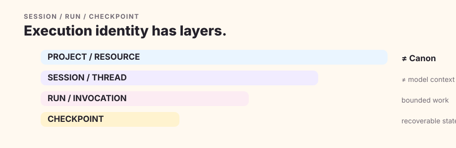

# Runtime & Integrations

Quillframe is provider-neutral because runtime identity, capability, and authority are separate concepts. A provider name never proves that a capability exists, and a capability never grants story or write authority by itself.

## Identity

`project/resource` identifies the work. `session/thread` is the durable conversational or execution relationship. `run/invocation` is one bounded execution attempt. `checkpoint` is a recoverable snapshot of exact execution state.

Provider session history is not Canon and is not a substitute for Project bootstrap.

## Capabilities

The current host manifest is the evidence for available tools, models, network, filesystem, GitHub, peer chat, local agents, or human review. Undeclared capability is unavailable. Credentials and authority tokens stay outside ordinary semantic context.

## Resume

Resume revalidates the current framework/project compatibility, latest checkpoint, referenced artifact fingerprints, live Project authority, pending approval/write intent, required capabilities, and consume-once state. A different framework revision is a dependency migration question, not ordinary resume.

## Independent semantic execution

Eligible independent paths can include a separate local agent invocation, provider call, service/MCP worker, GitHub job, peer chat, local model, or human—when current capability evidence supports it. Transport failure can fall back to another eligible transport for the same fingerprint. A valid semantic rejection cannot.

## Control plane

The Control Plane stores durable event/handoff/result lifecycle and metadata-only receipts. It can prove that a result was dispatched, returned, validated, and consumed; it cannot turn the result into Canon or editorial acceptance.
