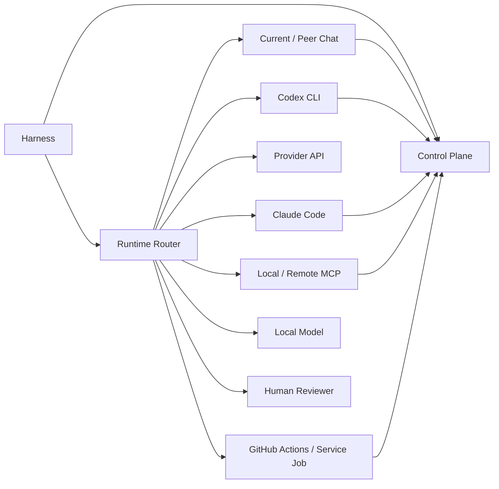

# Runtime Integrations · 运行时集成

NovelForge 是 provider-neutral。Runtime 的选择依据 capability、independence、permission、session、automation 与 cost constraints，而不是绑定某一家厂商。

## Integration Map



## Chat Sessions

当前 chat 可以作为 manager runtime，但同一 chat 内部 role-play review 不算 independent semantic judgment。

Separate peer chat 可以在收到 bounded blind packet、并返回 typed fingerprint-bound evidence 时作为 independent reviewer。`peer_chat_relay.py` 为 relay workflow 提供 nonce/fingerprint binding。

## Codex CLI

Local Codex 可以运行完整 Harness 或 bounded specialist。Mandatory independent review 需要 separate invocation/session。若本地 Codex 已通过官方支持方式认证，NovelForge 不要求额外再配置一份 OpenAI API key。

## Claude Code

Claude Code 可以运行 full Harness 或 bounded worker session。`.claude/` 下 hooks 只记录 deterministic lifecycle/file-change telemetry，不能替代 independent semantic review。

## Provider APIs

Provider API adapter 只是 optional transport。必须遵守同一 typed semantic/output contract、context isolation、provenance 与 permission boundary。

Normal CI 只跑 dry-run/contract test，不花 provider inference usage。

## MCP

本地默认：stdio MCP。

未来 remote service：Streamable HTTP MCP，并执行 auth、Origin validation、session/protocol handling 等正常 transport security。

Generic Control Plane 暴露 operational tools；高 authority Canon settlement 仍然是 Harness/Project transaction，而不是默认开放的 raw MCP capability。

## GitHub Actions / Service Jobs

GitHub 可以承担：
- deterministic CI；
- 通过 `repository_dispatch` 或等价 transport 的 event ingress；
- 有 independent worker backend 时的 semantic relay/service queue；
- 不调用 API 模型的 peer-chat relay bridge。

Workflow event 只是 candidate/transport message，不会提升 authority。

### Operational Workflows

- `novelforge-ci.yml`：默认 deterministic release gate，不执行 live model。
- `novelforge-contracts.yml`：可复用 deterministic contracts。
- `novelforge-event-router.yml`：typed external event ingress。
- `novelforge-chat-semantic-bridge.yml`：用户 relay 的 independent peer-chat semantic path，不调用 API 模型。
- `novelforge-semantic-live.yml`：可选、手工触发的 provider-backed semantic eval；必须显式配置 API secret，可能产生 provider billing。
- `novelforge-weekly-maintenance.yml`：定时 deterministic observation / queueing；不执行 LLM，不自动 promote Framework behavior。

Weekly maintenance 可以生成 Corpus discovery/eval queue，但真正 Web/GitHub/MCP discovery 仍需要 host 已授权 connector；不能伪造 source access。

## Webhooks

Provider-specific webhook 应先 normalize 成 Generic typed event，再由 Harness 处理：

```text
provider webhook
→ adapter
→ typed NovelForge event
→ idempotency/provenance validation
→ Harness classification
```

不要为每一家 provider 发明独立的 resume/idempotency 语义。

## Human Review

Human reviewer 是一等 independent runtime。仍使用相同 artifact fingerprint、bounded instructions、return contract、provenance 与 consume-once behavior。

## Fallback

Infrastructure failure 可以 checkpoint 后 fallback 到下一个 eligible runtime。有效 semantic reject 不能被伪装成 infrastructure failure 来换 reviewer。

## Secrets

Credential 属于 host/runtime configuration。不得把 provider token 写进 Project Canon、semantic job、corpus record、被 commit 的 runtime SQLite 或 framework source。
