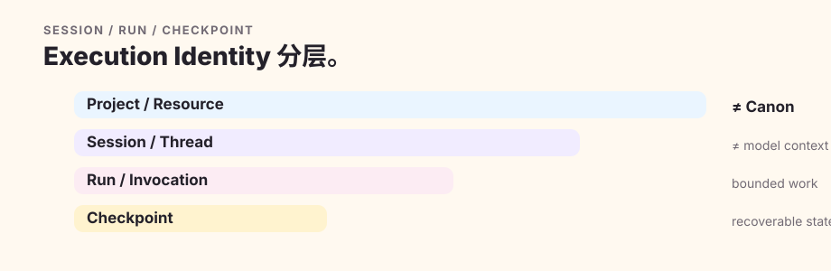

# 运行时与集成

Quillframe 能保持不绑定具体服务提供方，是因为**运行身份、可用能力和事实权威**是三个不同概念。服务提供方的名字不能证明某项能力真的存在；能力本身也不会授予故事事实或写入权限。

## 身份

`project/resource` 标识工作对象；`session/thread` 表示可持续的对话或执行关系；`run/invocation` 表示一次受限的执行尝试；`checkpoint` 保存精确执行状态，供后续恢复。

服务提供方的会话历史不是正典，也不能替代项目启动校验。

## 本地 coding-agent 宿主

Claude Code 与 Codex 都可以承载本地 Quillframe session，但两个宿主都不拥有 Quillframe workflow semantics。它们只把各自 lifecycle event 规范化后交给同一个确定性 bootstrap core。

对于 consumer Project，强制入口是：

`Project discovery → exact lock/attestation verification → quillframe_agent_session_v1 → exactly one task_mode → one active manager run → sparse Context execution`

宿主会注入 `QF_SESSION_ID`。仅完成 exact authority verification 仍不足以解锁有副作用的工作；模型/用户必须先做语义判断、明确选择且只选择一个 Quillframe mode，再执行 bootstrap context 中给出的精确 `quillframe host-run begin ...` 命令。Host state 明确区分 `blocked`、`awaiting_task_mode` 与 `running`。

进入 `running` 前，编辑、写入和 shell 工具默认 fail closed，唯一例外是经过严格解析的 Quillframe bootstrap command。Codex 的 `apply_patch` 按编辑处理。如果 Project lock / attestation 或 pinned Framework identity 在 run 之后改变，当前 authority binding 会失效，而不是被静默刷新后继续运行。

Claude Code 使用生成的 `CLAUDE.md` 与 Project hooks。Codex 会先读取直接包含 bootstrap 规则的 `AGENTS.md`；Project-local `.codex/hooks.json` 还需要用户明确 trust Project / hook。如果 Codex 启动后没有收到 `QF_SESSION_ID`，应先通过 `/hooks` 审查并信任 Quillframe hooks，然后重启 session，再进行有副作用的工作。Quillframe 不绕过宿主自身的安全边界。

较早创建的 consumer Project 可以显式执行 `quillframe host-install .` 修复当前生成式宿主文件。Host repair 不是 Framework repin，也不会修改 Canon 或其他故事状态；遇到未知的用户自定义宿主指令时会保留原内容并要求人工合并。

## 能力

当前宿主环境清单，才是工具、模型、网络、文件系统、GitHub、同伴会话、本地代理或人工评审是否可用的能力证据。未声明的能力视为不可用；凭据和授权令牌不会进入普通语义上下文。

## 恢复

恢复时必须重新核对当前框架与项目的兼容关系、最新检查点、制品指纹、实时项目权威、待确认事项或写入意图、所需能力和一次性消费状态。框架版本变化属于依赖迁移问题，不是普通恢复。

## 独立语义执行

可用的独立执行通道可以是单独的本地代理调用、服务提供方调用、服务或 MCP 工作者、GitHub 任务、同伴会话、本地模型或人工评审，只要当前能力证据确实支持。传输故障可以在同一指纹下切换执行通道；有效的语义拒绝不能通过换通道重抽。

## 控制平面

控制平面保存可持久恢复的事件、交接和结果生命周期，以及只含元数据的回执。本地宿主 manager session 使用既有 typed session contract，而不是为 Claude 或 Codex 各自建立平行 schema。控制平面可以证明执行状态或结果已经派发、返回、校验和消费，却不能把这些状态或结果变成正典或编辑接受。
