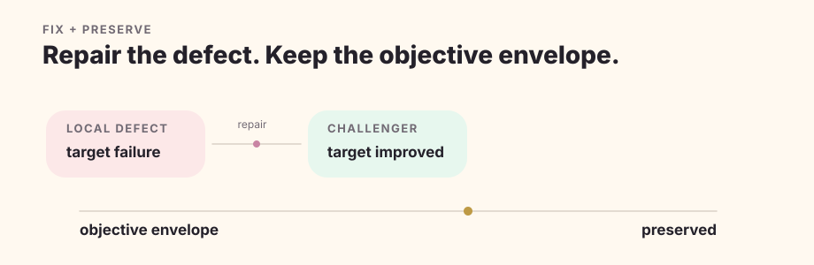
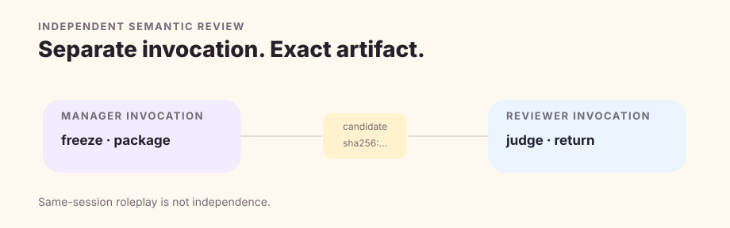

# Production Pipeline

A Quillframe DRAFT or REVISE run is an adaptive production graph. The graph has hard boundaries, but it does not force every chapter through the same number of model calls.

## 1. Freeze authority and sparse context

Resolve the exact framework/project authority for the run, establish session/run identity, select only task-relevant context, and verify stage/fingerprint boundaries. Future Plan outcomes cannot leak into current state. Regression bad examples and hidden expected labels stay out of first-pass generation.

The active plan for the exact target chapter and its owning book are bound task inputs in eligible planning and production stages. Core records these required inputs separately from the model's optional relevance selections; the selector cannot silently omit them. They remain subject to permission, invalidation, story-time and hard-budget checks, and are excluded from blind-reader and independent-review packets. This binding does not make planned events accepted facts.

## 2. Simulate before prose

Story/Canon preflight, private character enactment, character action proposals and scene action resolution establish causes, agendas, knowledge boundaries, pressure and changing choices. A registered model then projects only a Scene Realization Contract, current author objectives, a short Director Note and the IDs of the minimum eligible Writer context; private deliberation stays on the causal side. Reader Pressure runs on that writer-safe projection before prose.

Preflight checks whether the exact target has the required materials and whether proposed work conflicts with established facts or explicit hard constraints. Original fiction may start with empty Canon. Non-authoritative source descriptors do not prohibit the dispatched worker from making an internal proposal, and `db_fetch_performed=false` does not invalidate supplied frozen content. Neither permits fresh lookups, changes actual execution evidence or grants write authority. Missing required material and real contradictions still fail; continuity later checks the candidate rather than treating its pending acceptance as a defect. Rejected runs retain their original judgments and require a fresh run after a framework repair.

### Native response constraints

The reference production runtime requests a native JSON response constraint for `character.action_propose` and `scene.resolve_actions`. It uses an explicit subset containing only the original contract's required fields, recursively. Relevant motive, tactic, resistance and cost remain expressible in the action text; optional fields are not replaced with mandatory nulls. All findings, uncertainty and blocking repair routes remain available. The complete original contract and reference checks still apply.

`AgentJob.output_schema` binds the constraint into the actual request fingerprint. OpenAI Chat Completions and Responses codecs forward it explicitly; the Codex CLI relay supplies [`--output-schema`](https://developers.openai.com/codex/noninteractive), preserves the schema and its hash, and validates the exact returned text before publication. Extra trailing bytes, duplicate JSON keys, nonfinite numbers and shape mismatches are rejected without rewriting the response or retrying it. Valid semantic failures are still valid transport results, not passing quality judgments.

This is a limited transport profile, not support for arbitrary JSON Schema or every model service. Open maps, unsupported schema constructs and the current Anthropic codec fail explicitly. The constrained job requires an already verified text model and resolved protocol; no additional capability probe or fallback is issued, and requesting a schema does not mark provider support as verified. Unconstrained jobs omit the new field, retaining their existing fingerprints. Previously dispatched jobs must not be reconstructed with new constraints and replayed; preserve their original evidence and use a fresh run. Fixture tests establish routing and rejection behavior, not live provider acceptance or independent review.

## 3. Generate an internal candidate

One direct Surface Writer realizes prose from the compact Writer pack. There is no complete intermediate prose draft for a second model to rewrite. The resulting candidate is immediately frozen and fingerprinted, and remains private until the exact release gate.

## 4. Qualify before spending independent review

`quality/candidate_qualification.py` expects registered non-independent semantic evidence for candidate self-audit and reader engagement, plus continuity evidence. A repair-cycle candidate also needs a `quality.compare` preservation check against its objective envelope.

The result is one of `awaiting_semantic`, `repair_required`, or `qualified_for_independent`. Qualification is not independent review and cannot replace it.

## 5. Repair the owning mechanism

Local surface defects can receive local rewrite. A surface cluster can require scene realization again. SAFE-BUT-FLAT returns to Reader Pressure and Scene Simulation. Character failure returns to Character Simulation. Story/plan failure returns upstream. Context failure returns to Context/Memory.

Every repair cycle follows FIX + PRESERVE. A successful local repair that damages the objective envelope, reader value, or relationship energy is not a successful overall repair.

### Repair an internal qualification failure

Studio offers **Repair this version** only when Core can verify a stopped `failed_gate` run with an exact private candidate and a `repair_required` qualification receipt. The action registers a new `REVISE` run. Core freezes the source run, checkpoint, candidate bytes, diagnostics and confirmed execution journal in the same transaction; the browser supplies only exact references. The rejected run and its outputs remain unchanged.

`author.run.execute` can use `inherit_repair_request=true` for that bound run. Core supplies the original instruction, reader grip and rule material; registration also inherits the exact selected author preferences. Callers cannot replace them or submit a passing comparison. Ordinary `DRAFT` execution still requires its execution inputs explicitly. Changed objectives, stale source context, missing candidate evidence, and transport failures need their own resolution; this entry does not convert them into prose repairs.

The registered `editor.repair_spec` receives the failed candidate and bounded diagnosis. Its objective envelope copies the explicit request and frozen active plans, without deriving goals from rejected prose. The model selects the repair owner, generation mode, FIX and PRESERVE. A fresh Writer receives current story material and those constraints, without incumbent prose or the full critique trajectory; a bounded repair receives only exact fingerprint-bound edit windows. All production mechanisms execute again under the new run's journal and budget.

After generation, registered `quality.compare` receives both candidates' exact text and verified SHA-256 fingerprints. Its target-improvement and objective-preservation judgments feed the existing qualification gate. Lineage retains the original comparison ancestry; fresh regeneration has no prose parent. A regression or inconclusive comparison cannot release text. The current entry accepts a failed `REVISE` as a later source only if its actual comparison passed and selected that challenger, and its parent evidence remains intact. A losing repair is preserved as diagnostic evidence but cannot replace the incumbent or serve as the next baseline through this entry. Blind Reader and independent review receive only their allowed fresh-candidate inputs. Repair never accepts, settles or publishes the chapter automatically.

## 6. Evolve candidates without contaminating fresh regeneration

Quality Evolution compares an incumbent with a challenger through registered semantic comparison. Candidate Lineage records whether the challenger is a repair, fresh regeneration, or user edit. A repair derives prose from its comparison parent; a fresh regeneration keeps a comparison parent but has no prose parent.

## 7. Run independent review on the exact candidate

When required, freeze and package the qualified candidate, checkpoint, dispatch to a genuinely separate eligible invocation/session, validate the returned typed result against the exact candidate fingerprint, consume it once, and route any valid rejection back to repair.

## 8. Cross the user-visible gate

Only a candidate whose applicable semantic, continuity, lineage, and independence gates resolve may be called a Review Draft or production-ready according to the current contract. Acceptance remains a separate user/editorial decision; settlement remains a separate authorized state mutation.
