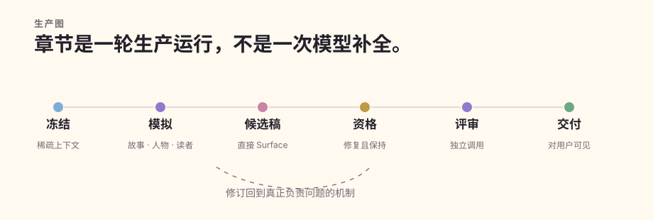
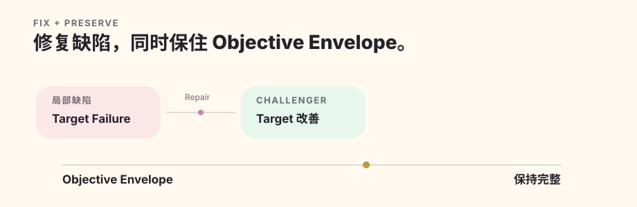
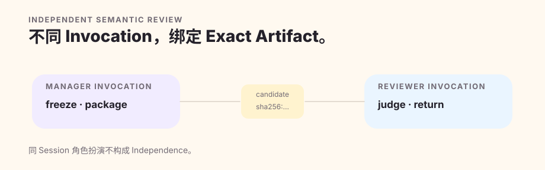

# 生产流水线

Quillframe 的 DRAFT / REVISE 不是固定次数的模型调用，而是一张 adaptive production graph。图上的 boundary 是硬的，但每章不必机械走完全相同的调用数量。

## 1. Freeze Authority 与 Sparse Context

解析本轮 exact Framework/Project authority，建立 session/run identity，只选择 task-relevant context，并验证 stage/fingerprint boundary。Future Plan 结果不得提前进入 current state；regression bad example 与 hidden expected label 不得污染 first-pass generation。

## 2. 正文之前先 Simulation

Story/Canon preflight、scene simulation、private character state、character action proposal、scene action resolution 与 Reader Pressure 先建立因果、agenda、knowledge boundary、pressure、reward 与 forward pull，再进入 surface realization。

## 3. 生成内部 Candidate

Event-first Raw Draft 只存在于内部；Surface realization 把模拟后的事件结构实现成 prose。随后 freeze candidate + fingerprint。Raw Draft 永远不是 user-visible artifact。

## 4. Independent Review 之前先 Qualification

`quality/candidate_qualification.py` 要求 registered、non-independent 的 candidate self-audit 与 reader engagement semantic evidence，再加 continuity evidence。Repair cycle > 0 时，还需要 `quality.compare` 对 objective envelope 做 preservation check。

输出只可能是 `awaiting_semantic`、`repair_required`、`qualified_for_independent`。Qualification 本身不是 independent review，也不能替代它。

## 5. 回到 Owning Mechanism 修复

局部 Surface defect 可以 local rewrite；Surface cluster 可以重新 realization；SAFE-BUT-FLAT 回 Reader Pressure + Scene Simulation；Character failure 回 Character Simulation；Story/Plan failure 回上游；Context failure 回 Context/Memory。

每个 repair cycle 都遵守 FIX + PRESERVE。局部 target 改好了，但 objective envelope、reader value 或 relationship energy 被破坏，不算整体 repair 成功。

## 6. Candidate Evolution 不污染 Fresh Regeneration

Quality Evolution 通过 registered semantic comparison 比较 incumbent 与 challenger。Candidate Lineage 记录 challenger 是 repair、fresh regeneration 还是 user edit。Repair 的 prose parent 等于 comparison parent；fresh regeneration 仍有 comparison parent，但 prose parent 必须为空。

## 7. 对 Exact Candidate 执行 Independent Review

Gate 要求 independence 时，先 freeze/package qualified candidate 并 checkpoint，再 dispatch 到真正独立且 eligible 的 invocation/session；返回结果必须与 exact candidate fingerprint 绑定，validate 后 consume-once。有效 rejection 回 repair，不允许 reviewer-shopping。

## 8. User-visible Gate

只有 applicable semantic、continuity、lineage、independence gate 都解决的 candidate，才可以按当前 contract 称为 Review Draft / production-ready。Acceptance 是另外的用户/编辑决定；Settlement 又是另外的 authorized state mutation。
