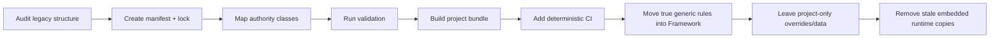

# Project Adapters

## Purpose

NovelForge is one generic framework used by many independent novel repositories. A Project Adapter maps a project's physical storage into the logical Project SDK contract without importing project-specific facts into the framework.

## Standard project

New projects should use the standard Project SDK structure created by:

```bash
python novelforge.py project init <path> --id <PROJECT-ID> --title "Title"
```

Core identity:

```text
novelforge.toml
novelforge.lock.json
```

Then the project owns its `profiles/`, `bible/`, `state/`, `plans/`, `manuscripts/`, `research/`, `corpus/`, `evals/`, `tests/`, `specs/`, and `assets/`.

## Legacy project

Existing fiction projects do not need a destructive directory rewrite before they can use NovelForge.

A legacy adapter can map:
- legacy project identity → Project SDK identity;
- existing Story Bible/database paths → logical authority paths;
- old prose rules → Framework Fundamentals + true project overrides;
- old runtime copies → pinned framework dependency;
- old draft/review/accepted locations → explicit lifecycle classes;
- existing ledgers/dependency views → standard state interfaces.

The adapter may know the legacy layout; the **generic framework source must not know the concrete project's facts**.

## Adapter contract

At bootstrap resolve:

```yaml
project_id:
project_version:
project_root:
framework_lock:
authority_paths:
profile_paths:
canon_cutoff:
active_plan_paths:
research_paths:
eval_paths:
bundle_ref:
```

Then Context Curator selects a sparse subset for the current task.

## Migration strategy

Recommended path:



Perform migrations incrementally and verify behavior/authority compatibility after each phase.

## Framework sync

Projects should avoid remote file ping-pong during ordinary production. Resolve the pinned framework release once and materialize a verified read-only dependency bundle under:

```text
.novelforge/framework/
```

The lockfile records the release/version/commit/fingerprint. Project tasks use the local synchronized dependency plus local project state.

## Upgrade

A material framework upgrade is a structural project change:

```text
spec
→ plan
→ tasks
→ update lock/bundle
→ validate
→ run project tests/evals
→ accept upgrade
```

Do not silently change the framework version underneath an active project session.

## Related contracts

- `harness/PROJECT_ADAPTER_PROTOCOL.en.md`
- `docs/project-sdk.en.md`
- `project_sdk.py`
