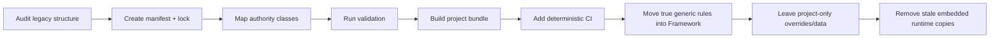

# Project Adapters · 项目适配器

## 目的

NovelForge 是一个 Generic Framework，服务许多彼此独立的小说 repo。Project Adapter 负责把某个项目的物理存储映射到 Project SDK logical contract，而不是把项目事实 import 进 Framework。

## Standard Project

新项目建议直接使用 Project SDK：

```bash
python novelforge.py project init <path> --id <PROJECT-ID> --title "Title"
```

核心身份文件：

```text
novelforge.toml
novelforge.lock.json
```

之后由项目自己拥有 `profiles/`、`bible/`、`state/`、`plans/`、`manuscripts/`、`research/`、`corpus/`、`evals/`、`tests/`、`specs/`、`assets/`。

## Legacy Project

已有小说不必先做 destructive directory rewrite 才能使用 NovelForge。

Legacy Adapter 可以映射：
- legacy project identity → Project SDK identity；
- 现有 Story Bible/database → logical authority path；
- old prose rules → Framework Fundamentals + 真正 project override；
- old runtime copy → pinned framework dependency；
- old draft/review/accepted location → explicit lifecycle class；
- 现有 ledger/dependency view → standard state interface。

Adapter 可以知道 legacy layout；但 **Generic Framework source 不能知道 concrete project facts**。

## Adapter Contract

Bootstrap 时解析：

```yaml
project_id:
project_version:
project_root:
framework_lock:
authority_paths:
profile_paths:
canon_cutoff:
active_plan_paths:
research_paths:
eval_paths:
bundle_ref:
```

然后由 Context Curator 只选择当前 task 需要的 sparse subset。

## Migration Strategy

推荐：



Migration 分阶段执行，每阶段验证 behavior/authority compatibility。

## Framework Sync

普通生产不应该每次跨 repo ping-pong 读取 framework 文件。Project 应解析一次 pinned framework release，并把 verified read-only dependency materialize 到：

```text
.novelforge/framework/
```

Lockfile 记录 release/version/commit/fingerprint。Project task 使用本地同步 dependency + 本地 project state。

## Upgrade

Material framework upgrade 属于 structural project change：

```text
spec
→ plan
→ tasks
→ update lock/bundle
→ validate
→ run project tests/evals
→ accept upgrade
```

Active project session 期间不得静默把底层 framework version 换掉。

## Related Contracts

- `harness/PROJECT_ADAPTER_PROTOCOL.zh-CN.md`
- `docs/project-sdk.zh-CN.md`
- `project_sdk.py`
