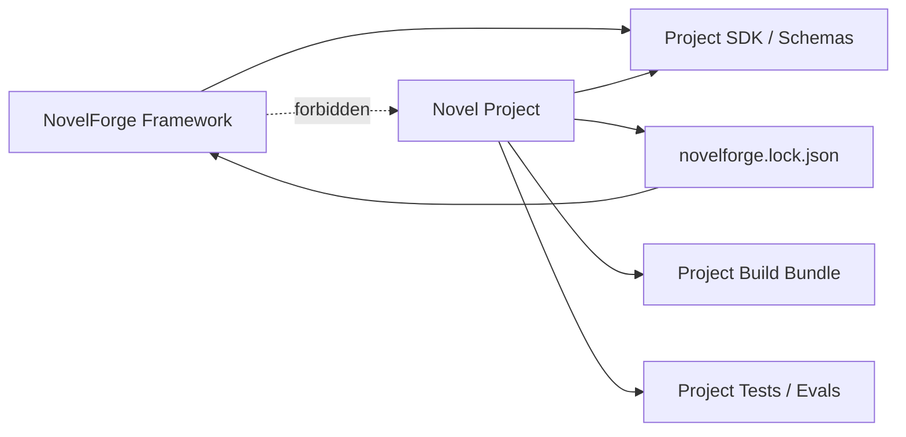

# NovelForge Project SDK · Software-Engineering Contract for Fiction Projects

## Goal

Every NovelForge novel project should behave like a maintainable software project:

- cloneable and self-describing;
- pinned to a known framework version;
- structurally validated;
- testable before release;
- explicit about source-of-truth vs generated views;
- migration-safe;
- reproducibly buildable into a compact agent/context bundle;
- auditable and rollback-friendly;
- usable from ChatGPT, Codex, Claude Code, CI, or other hosts without redefining the project model.

This idea borrows the **engineering discipline** of mature software repositories: feature specifications, implementation plans, explicit task dependencies, build/test/verify scripts, architecture boundaries, and phase checkpoints. It does not copy any one repository's domain or tech stack.

## Dependency direction



A framework release never imports a consumer project.

A project consumes a **versioned framework contract** and supplies only project-owned data, plans, profiles, tests, research, manuscripts, and Canon state.

## Recommended repository layout

```text
my-novel/
├── project.yaml
├── novelforge.lock.json
├── README.en.md
├── README.zh-CN.md
├── AGENTS.md
├── CLAUDE.md
├── .gitignore
├── .github/
│   └── workflows/
│       └── novel-project-ci.yml
├── specs/
│   └── 001-example-change/
│       ├── spec.en.md
│       ├── spec.zh-CN.md
│       ├── plan.en.md
│       ├── plan.zh-CN.md
│       ├── tasks.en.md
│       └── tasks.zh-CN.md
├── profiles/
│   ├── genre.yaml
│   ├── platform.yaml
│   ├── prose.yaml
│   ├── reader.yaml
│   └── project.yaml
├── bible/
│   ├── book/
│   ├── characters/
│   ├── relationships/
│   ├── world/
│   ├── organizations/
│   └── research/
├── state/
│   ├── canon/
│   ├── ledgers/
│   ├── information/
│   ├── resources/
│   ├── dependencies/
│   └── migrations/
├── plans/
│   ├── book/
│   ├── volumes/
│   ├── units/
│   ├── chapters/
│   └── scene-cards/
├── manuscripts/
│   ├── draft/
│   ├── review/
│   └── accepted/
├── evals/
│   ├── capability/
│   ├── regression/
│   └── fixtures/
├── tests/
│   ├── continuity/
│   ├── state/
│   └── release/
├── research/
│   ├── sources/
│   ├── claims/
│   └── notes/
├── corpus/
│   ├── refs/
│   └── project-benchmarks/
├── assets/
├── scripts/
├── dist/                 # generated, usually ignored
└── .novelforge/          # runtime/cache, ignored
```

The exact physical format may be Markdown, YAML, JSON, SQLite, or another supported backend. The **logical boundaries** are the contract.

## Source vs derived vs generated

Every project artifact belongs to one class:

### Authoritative source
Examples:
- Accepted Canon;
- current character facts;
- relationship state;
- resource ledger;
- verified research claim;
- active project profile.

### Plan / proposal
Examples:
- volume outline;
- chapter plan;
- Scene Card;
- proposed relationship progression.

### Derived view
Examples:
- date index;
- character-presence matrix;
- unresolved-loop dashboard;
- dependency report.

Derived views must be rebuildable from authoritative state.

### Generated artifact
Examples:
- Raw Draft;
- Review Draft;
- semantic audit;
- release bundle;
- temporary context manifest.

Generated artifacts never become Canon merely because they were built.

## Framework lockfile

`novelforge.lock.json` pins the framework contract used by the project:

```json
{
  "schema": "novelforge_lock_v1",
  "framework": {
    "name": "NovelForge",
    "version": "7.0.0",
    "commit": "<sha>",
    "bundle_fingerprint": "sha256:..."
  },
  "project_schema_version": "1",
  "updated_at": "..."
}
```

A project task should normally read a **local synchronized framework bundle** resolved from this lockfile rather than repeatedly fetching many framework files from a remote repository.

This keeps the dependency one-way while avoiding chat/runtime ping-pong between repositories.

## Framework sync model

```text
novelforge.lock.json
→ framework release / commit
→ verify bundle fingerprint
→ materialize read-only bundle into .novelforge/framework/
→ run project task locally against project + pinned framework
```

`.novelforge/framework/` is runtime dependency material, not project Canon and normally not committed.

Upgrading the framework is an explicit dependency update with compatibility tests.

## Change classes

Engineering discipline should not become bureaucracy.

### Class A · Micro/content edit
Examples: sentence-level accepted correction, typo, local metadata clarification.

Use normal project transaction and tests. No feature spec required.

### Class B · Chapter/unit production
Use chapter plan, Scene Cards, context manifest, draft/review gates, continuity tests, and release/build manifest. A separate `specs/` feature is optional unless the change alters structure or requirements.

### Class C · Structural feature/change
Examples:
- volume redesign;
- new relationship architecture;
- schema change;
- new project-specific subsystem;
- major research model change;
- framework upgrade with behavior changes.

Required:

```text
spec → plan → tasks → implementation → verification → acceptance
```

### Class D · Canon migration
Any change to already-settled Canon/state uses an explicit migration/state-delta transaction with before-state, evidence, dependency impact, post-condition, and rollback/trace.

### Class E · Release
A release must be reproducibly buildable and testable.

## Feature specification model

For Class C changes:

```text
specs/NNN-short-name/
├── spec.en.md
├── spec.zh-CN.md
├── plan.en.md
├── plan.zh-CN.md
├── tasks.en.md
└── tasks.zh-CN.md
```

### `spec`
Defines:
- problem/context;
- user/editor value;
- current-state audit;
- requirements;
- non-goals;
- compatibility constraints;
- acceptance scenarios;
- Canon/authority impact;
- reader/prose impact;
- risks.

### `plan`
Defines:
- chosen architecture;
- alternatives considered;
- affected project objects/files;
- dependency graph;
- migration strategy;
- test/eval strategy;
- phases/checkpoints;
- rollback.

### `tasks`
Defines:
- exact task IDs;
- dependencies;
- parallelizable tasks;
- exact target paths/objects;
- completion criteria;
- per-phase verification checkpoint.

The Harness may generate or maintain these files, but user-visible story changes still follow normal authority rules.

## Project CI

A professional project should be able to run deterministic checks without invoking a paid model:

```text
project schema validate
→ bilingual docs / required files
→ stable-ID uniqueness
→ Canon/plan lifecycle checks
→ link/reference integrity
→ dependency graph integrity
→ ledger arithmetic where applicable
→ date/timeline consistency
→ accepted-manuscript/state binding
→ derived-view freshness
→ regression fixture structure
→ release bundle build
```

Live semantic/prose evals are separate opt-in jobs unless a host provides included model execution.

## Build

`novelforge project build` should create a compact deterministic bundle such as:

```text
dist/
├── project.bundle.json
├── authority.manifest.json
├── accepted.manifest.json
├── active-plan.manifest.json
├── research.manifest.json
├── profile.manifest.json
└── fingerprints.json
```

The bundle is an **index/compiled view**, not a replacement authority.

Purpose:
- reduce repeated remote reads;
- let chat sessions bootstrap efficiently;
- provide stable fingerprints;
- allow CI/runtime compatibility checks;
- keep sparse context selection possible.

## Tests as fiction engineering

Tests do not decide whether prose is artistically great. They protect invariants.

Examples:
- no duplicate stable ID;
- no future-plan fact already present in current state;
- no character knows an unrevealed secret;
- resource arithmetic balances;
- relationship transition has Accepted evidence;
- accepted chapter fingerprint matches state ledger;
- a referenced character/location/object exists;
- no stale derived view claims authority;
- project profile does not disable mandatory framework anti-AI fundamentals without an explicit allowed profile exception.

Semantic/reader-quality evals complement deterministic tests.

## Release model

Suggested project release identity:

```text
project version
+ framework lock version
+ accepted Canon cutoff
+ project bundle fingerprint
+ eval status
```

A release may represent an editorial milestone rather than public publication.

## Migration model

Framework or project-schema upgrades should create a migration spec when non-trivial:

```text
old schema/state
→ migration plan
→ backup/checkpoint
→ transform
→ validate
→ rebuild derived views
→ run tests
→ commit new lock/schema version
```

Never silently reinterpret old Canon under a new schema.

## Complete-software-project principle

A novel repository should answer, without relying on chat memory:

- What project is this?
- What framework version does it use?
- What is authoritative?
- What has actually happened?
- What is only planned?
- What is currently being produced?
- What tests protect continuity?
- What research supports real-world claims?
- What user/project profiles apply?
- How do I build a compact context bundle?
- How do I upgrade or roll back?
- How do I know a release is valid?

If those answers only exist in a conversation, the novel is not yet a complete engineering project.
