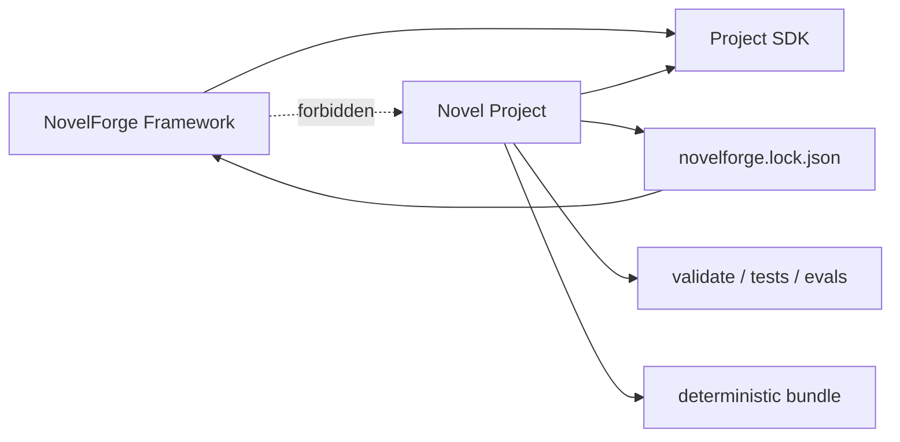

# NovelForge Project SDK · Fiction as a Complete Software Project

## Goal

Every consuming novel should be independently cloneable, self-describing, testable, buildable, migration-safe, and rollbackable without relying on chat memory.

NovelForge supplies the generic engine; a project supplies one story's facts, profiles, plans, research, manuscripts, tests, and Canon.



## Standard root

```text
my-novel/
├── novelforge.toml
├── novelforge.lock.json
├── README.en.md
├── README.zh-CN.md
├── AGENTS.md
├── CLAUDE.md
├── .gitignore
├── .github/workflows/
├── specs/
├── profiles/
├── bible/
├── state/
├── plans/
├── manuscripts/
├── research/
├── corpus/
├── evals/
├── tests/
├── assets/
├── scripts/
├── dist/                 # generated
└── .novelforge/          # local dependency/runtime cache
```

The physical storage may use Markdown, JSON, TOML, SQLite, or adapter-backed legacy structures. The logical authority classes are the invariant.

## Project manifest

`novelforge.toml` is the project manifest. It declares project identity, schema compatibility, logical authority paths, profiles, and build settings.

Typical sections:

```toml
[novelforge]
schema = "novelforge_project_v1"
project_schema_version = "1"
minimum_framework_version = "7.0.0"

[project]
id = "PROJECT-EXAMPLE"
title = "Example Novel"
language = "en"
version = "0.1.0"
status = "active"

[authority]
accepted_canon = "state/canon"
current_state = "state"
active_plans = "plans"
project_profiles = "profiles"
research = "research"
regressions = "evals/regression"
```

## Framework lock

`novelforge.lock.json` pins the exact framework dependency:

```json
{
  "schema": "novelforge_lock_v1",
  "framework": {
    "name": "NovelForge",
    "version": "7.0.0",
    "commit": "<sha>",
    "bundle_fingerprint": "sha256:..."
  },
  "project_schema_version": "1"
}
```

Ordinary production should use a verified local read-only framework materialization under `.novelforge/framework/` rather than repeatedly fetching dozens of framework files from another repository.

## Artifact classes

### Authoritative source
Accepted Canon, current state, character/relationship/world facts, project profiles, verified research claims.

### Plan / proposal
Book/volume/unit/chapter plans, Scene Cards, proposed future relationship or state changes.

### Derived view
Timeline index, presence matrix, dependency report, open-loop dashboard, compiled state summaries. Must be rebuildable.

### Generated artifact
Raw Draft, Review Draft, semantic audit, temporary Context Manifest, build bundle. Generation alone does not grant Canon authority.

## Engineering workflow

```text
bootstrap
→ validate
→ classify change
→ plan/spec when warranted
→ implement/produce
→ deterministic tests + semantic/eval gates as applicable
→ explicit acceptance
→ settlement/migration if Canon changes
→ build/release
```

## Change classes

### A · Micro/content edit
Typos, local metadata clarification, small accepted correction. Normal transaction + tests; no feature spec required.

### B · Chapter/unit production
Use chapter/unit plans, Scene Cards, Context Manifest, prose/reader gates, continuity tests, and release/build manifest. Do not create software tickets for every paragraph.

### C · Structural change
Volume redesign, schema change, relationship architecture, major research model change, project subsystem, or behavior-changing framework upgrade:

```text
spec → plan → tasks → implementation → verification → acceptance
```

### D · Canon migration
Already-settled Canon/state changes require exact before-state, evidence, dependency impact, checkpoint/write intent, post-condition, trace, and rollback capability.

### E · Release
Must be reproducibly buildable and validation/test status must be explicit.

## Structural change specs

```text
specs/NNN-short-name/
├── spec.en.md
├── spec.zh-CN.md
├── plan.en.md
├── plan.zh-CN.md
├── tasks.en.md
└── tasks.zh-CN.md
```

`spec` defines problem/current-state/requirements/non-goals/acceptance/authority impact.

`plan` defines architecture/alternatives/affected objects/dependencies/migration/tests/phases/rollback.

`tasks` defines exact IDs, targets, dependencies, parallelizable work, completion criteria, and phase checkpoints.

This borrows proven software-engineering discipline without turning ordinary prose production into bureaucracy.

## Deterministic project checks

A professional project should be able to validate without paid model execution:

- manifest/lock compatibility;
- required directory/file structure;
- stable-ID uniqueness;
- lifecycle boundaries (Plan/Review ≠ Accepted);
- links/references/dependency integrity;
- resource arithmetic where applicable;
- timeline/date consistency;
- Accepted manuscript ↔ state-ledger fingerprints;
- derived-view freshness;
- regression fixture structure;
- profile attempts to disable mandatory framework fundamentals;
- deterministic project bundle build.

Semantic prose/reader quality evals complement deterministic tests; they do not replace them.

## Build

`project_sdk.py build` creates a compact indexed `dist/` bundle with file classes and fingerprints. It is a compiled view, not a second authority.

Purpose:
- fast chat/agent bootstrap;
- stable fingerprints;
- fewer cross-repository reads;
- compatibility checks;
- sparse Context selection.

## Executable SDK

```bash
python project_sdk.py init <path> --id PROJECT-X --title "Novel"
python project_sdk.py validate <path>
python project_sdk.py spec-new <path> --title "Structural change"
python project_sdk.py build <path>
python project_sdk.py self-test
```

## Legacy migration

Existing mature novel repositories may keep their physical layout behind a Project Adapter. Migrate incrementally:

```text
audit
→ add manifest + lock
→ map authority classes
→ validate/build
→ add deterministic CI
→ move truly generic rules into NovelForge
→ retain only project data/overrides
→ remove stale embedded framework copies
```

Never import the concrete project's facts into NovelForge while extracting generic mechanisms.

## Complete-project test

A novel repository should answer without chat memory:
- What project is this and what framework version does it use?
- What is authoritative, planned, generated, accepted, and settled?
- What is currently being produced?
- Which tests protect continuity/state?
- Which research supports factual claims?
- Which project/user profiles apply?
- How is a compact context bundle built?
- How is the framework upgraded or rolled back?
- How is a valid release identified?

If these answers live only in conversation history, the novel is not yet a complete engineering project.
