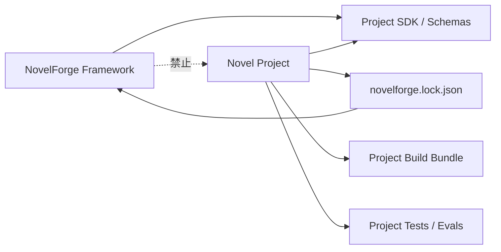

# NovelForge Project SDK · 小说项目软件工程契约

## 目标

每一个 NovelForge 小说项目都应该像一个可维护的软件工程：

- 可以独立 clone，并且自描述；
- 锁定明确的 framework 版本；
- 目录和 schema 可验证；
- release 前可以测试；
- 明确区分 source-of-truth 与 generated/derived view；
- schema / Canon migration 可控；
- 可以 reproducibly build 出 compact agent/context bundle；
- 所有变化可审计、可 rollback；
- ChatGPT、Codex、Claude Code、CI 或其他 host 都能使用同一项目结构，而不是每个 runtime 重发明一套。

这个设计借鉴成熟软件工程仓库的**工程纪律**：feature specification、implementation plan、显式任务依赖、build/test/verify、架构边界和 phase checkpoint；不复制任何具体项目的业务领域或技术栈。

## 依赖方向



Framework release 永远不能 import 某个 consumer project。

Project 只依赖一个**versioned framework contract**，然后提供自己的数据、计划、profile、tests、research、manuscripts 与 Canon state。

## 推荐 Repository Layout

```text
my-novel/
├── project.yaml
├── novelforge.lock.json
├── README.en.md
├── README.zh-CN.md
├── AGENTS.md
├── CLAUDE.md
├── .gitignore
├── .github/
│   └── workflows/
│       └── novel-project-ci.yml
├── specs/
│   └── 001-example-change/
│       ├── spec.en.md
│       ├── spec.zh-CN.md
│       ├── plan.en.md
│       ├── plan.zh-CN.md
│       ├── tasks.en.md
│       └── tasks.zh-CN.md
├── profiles/
│   ├── genre.yaml
│   ├── platform.yaml
│   ├── prose.yaml
│   ├── reader.yaml
│   └── project.yaml
├── bible/
│   ├── book/
│   ├── characters/
│   ├── relationships/
│   ├── world/
│   ├── organizations/
│   └── research/
├── state/
│   ├── canon/
│   ├── ledgers/
│   ├── information/
│   ├── resources/
│   ├── dependencies/
│   └── migrations/
├── plans/
│   ├── book/
│   ├── volumes/
│   ├── units/
│   ├── chapters/
│   └── scene-cards/
├── manuscripts/
│   ├── draft/
│   ├── review/
│   └── accepted/
├── evals/
│   ├── capability/
│   ├── regression/
│   └── fixtures/
├── tests/
│   ├── continuity/
│   ├── state/
│   └── release/
├── research/
│   ├── sources/
│   ├── claims/
│   └── notes/
├── corpus/
│   ├── refs/
│   └── project-benchmarks/
├── assets/
├── scripts/
├── dist/                 # generated，通常 ignore
└── .novelforge/          # runtime/cache，ignore
```

实际物理格式可以是 Markdown、YAML、JSON、SQLite 或其他支持 backend；真正重要的是**逻辑边界**。

## Source / Derived / Generated

项目 artifact 必须属于明确类别。

### Authoritative Source
例如：
- Accepted Canon；
- current character facts；
- relationship state；
- resource ledger；
- verified research claim；
- active project profile。

### Plan / Proposal
例如：
- volume outline；
- chapter plan；
- Scene Card；
- proposed relationship progression。

### Derived View
例如：
- 日期索引；
- 人物存在感矩阵；
- unresolved-loop dashboard；
- dependency report。

Derived view 必须能从 authoritative state 重建。

### Generated Artifact
例如：
- Raw Draft；
- Review Draft；
- semantic audit；
- release bundle；
- temporary Context Manifest。

Generated artifact 不会因为被 build 出来就自动成为 Canon。

## Framework Lockfile

`novelforge.lock.json` 锁定项目实际使用的 framework contract：

```json
{
  "schema": "novelforge_lock_v1",
  "framework": {
    "name": "NovelForge",
    "version": "7.0.0",
    "commit": "<sha>",
    "bundle_fingerprint": "sha256:..."
  },
  "project_schema_version": "1",
  "updated_at": "..."
}
```

项目运行时应优先使用由 lockfile 解析出的**本地同步 framework bundle**，而不是每次任务跨 repo 远程读取十几份 engine 文件。

这样既保持单向依赖，也解决多 repo ping-pong。

## Framework Sync Model

```text
novelforge.lock.json
→ framework release / commit
→ 验证 bundle fingerprint
→ materialize read-only bundle 到 .novelforge/framework/
→ 本地使用 project + pinned framework 执行 Harness
```

`.novelforge/framework/` 是 runtime dependency，不是 Project Canon，默认不 commit。

Framework upgrade 是显式 dependency update，并且必须跑 compatibility tests。

## Change Classes

软件工程纪律不能变成官僚主义。

### Class A · Micro / Content Edit
例如：已接受正文的局部修正、typo、局部 metadata 澄清。

走正常 project transaction + tests，不要求 feature spec。

### Class B · Chapter / Unit Production
使用 chapter plan、Scene Cards、Context Manifest、draft/review gates、continuity tests 与 build manifest。只有当本次生产同时改变结构/需求时，才额外建立 `specs/` feature。

### Class C · Structural Feature / Change
例如：
- volume redesign；
- 新 relationship architecture；
- schema change；
- 新 project-specific subsystem；
- 重大 research model 变化；
- 有行为变化的 framework upgrade。

必须执行：

```text
spec → plan → tasks → implementation → verification → acceptance
```

### Class D · Canon Migration
任何 already-settled Canon/state 修改，都走明确 migration / State Delta transaction，包含 before-state、evidence、dependency impact、post-condition 与 rollback/trace。

### Class E · Release
Release 必须可重复 build、可测试。

## Feature Specification Model

Class C 使用：

```text
specs/NNN-short-name/
├── spec.en.md
├── spec.zh-CN.md
├── plan.en.md
├── plan.zh-CN.md
├── tasks.en.md
└── tasks.zh-CN.md
```

### `spec`
定义：
- problem/context；
- user/editor value；
- current-state audit；
- requirements；
- non-goals；
- compatibility constraints；
- acceptance scenarios；
- Canon/authority impact；
- reader/prose impact；
- risks。

### `plan`
定义：
- chosen architecture；
- alternatives considered；
- affected project objects/files；
- dependency graph；
- migration strategy；
- test/eval strategy；
- phases/checkpoints；
- rollback。

### `tasks`
定义：
- exact task IDs；
- dependencies；
- parallelizable tasks；
- exact target paths/objects；
- completion criteria；
- per-phase verification checkpoint。

Harness 可以生成或维护这些文件，但所有 user-visible story change 仍服从正常 authority。

## Project CI

一个专业小说项目应该能在**不调用付费模型**的情况下跑 deterministic checks：

```text
project schema validate
→ bilingual docs / required files
→ stable-ID uniqueness
→ Canon/plan lifecycle checks
→ link/reference integrity
→ dependency graph integrity
→ ledger arithmetic（适用时）
→ date/timeline consistency
→ accepted manuscript/state binding
→ derived-view freshness
→ regression fixture structure
→ release bundle build
```

Live semantic/prose eval 是独立 opt-in job，除非 host 本身提供包含的模型执行能力。

## Build

`novelforge project build` 应生成 compact deterministic bundle，例如：

```text
dist/
├── project.bundle.json
├── authority.manifest.json
├── accepted.manifest.json
├── active-plan.manifest.json
├── research.manifest.json
├── profile.manifest.json
└── fingerprints.json
```

Bundle 是**索引/compiled view**，不是替代 authority。

作用：
- 减少重复远程读取；
- 让 chat session 快速 bootstrap；
- 提供稳定 fingerprint；
- 支持 CI/runtime compatibility check；
- 仍然可以做 sparse context selection。

## Tests as Fiction Engineering

测试不负责判定“文学上是不是伟大”，测试负责保护 invariant。

例如：
- stable ID 不重复；
- future-plan fact 没提前进入 current state；
- 角色不会提前知道尚未 reveal 的 secret；
- resource arithmetic 平衡；
- relationship transition 有 Accepted evidence；
- accepted chapter fingerprint 与 state ledger 一致；
- 引用人物/地点/物件真实存在；
- stale derived view 不冒充 authority；
- project profile 不能关闭 mandatory framework anti-AI fundamentals，除非是 framework 明确允许的 profile exception。

Semantic/Reader eval 与 deterministic tests 互补。

## Release Model

建议项目 release identity：

```text
project version
+ framework lock version
+ accepted Canon cutoff
+ project bundle fingerprint
+ eval status
```

Release 可以是内部 editorial milestone，不一定等于公开发布。

## Migration Model

Framework 或 project-schema 的非平凡升级应建立 migration spec：

```text
old schema/state
→ migration plan
→ backup/checkpoint
→ transform
→ validate
→ rebuild derived views
→ run tests
→ commit new lock/schema version
```

禁止在新 schema 下静默 reinterpret 旧 Canon。

## Complete-software-project Principle

一个小说 repo 应该在**完全不依赖聊天记忆**的情况下回答：

- 这是什么项目？
- 用哪个 framework 版本？
- 什么是 authority？
- 什么已经发生？
- 什么只是计划？
- 现在正在生产什么？
- 哪些 tests 保护 continuity？
- 哪些 research 支撑现实事实？
- 哪些 user/project profiles 生效？
- 怎么 build compact context bundle？
- 怎么升级 / rollback？
- 怎么判断一个 release 有效？

如果这些答案只存在于聊天里，这本小说还不算完整的软件工程项目。
