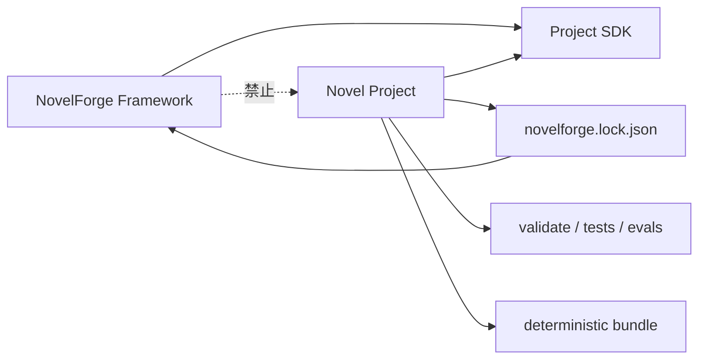

# NovelForge Project SDK · 把每一本小说当成完整软件工程

## 目标

每个 consuming novel 都应该能独立 clone、自描述、测试、build、migration、rollback，不依赖聊天记忆才能继续生产。

NovelForge 提供 Generic Engine；Project 只提供这一本小说自己的 facts、profiles、plans、research、manuscripts、tests 与 Canon。



## Standard Root

```text
my-novel/
├── novelforge.toml
├── novelforge.lock.json
├── README.en.md
├── README.zh-CN.md
├── AGENTS.md
├── CLAUDE.md
├── .gitignore
├── .github/workflows/
├── specs/
├── profiles/
├── bible/
├── state/
├── plans/
├── manuscripts/
├── research/
├── corpus/
├── evals/
├── tests/
├── assets/
├── scripts/
├── dist/                 # generated
└── .novelforge/          # local dependency/runtime cache
```

物理存储可以是 Markdown、JSON、TOML、SQLite，或者由 Adapter 兼容旧结构；真正稳定的是 logical authority classes。

## Project Manifest

`novelforge.toml` 是项目 manifest，声明 project identity、schema compatibility、logical authority paths、profiles 与 build settings。

典型结构：

```toml
[novelforge]
schema = "novelforge_project_v1"
project_schema_version = "1"
minimum_framework_version = "7.0.0"

[project]
id = "PROJECT-EXAMPLE"
title = "Example Novel"
language = "zh-CN"
version = "0.1.0"
status = "active"

[authority]
accepted_canon = "state/canon"
current_state = "state"
active_plans = "plans"
project_profiles = "profiles"
research = "research"
regressions = "evals/regression"
```

## Framework Lock

`novelforge.lock.json` 锁定精确 Framework dependency：

```json
{
  "schema": "novelforge_lock_v1",
  "framework": {
    "name": "NovelForge",
    "version": "7.0.0",
    "commit": "<sha>",
    "bundle_fingerprint": "sha256:..."
  },
  "project_schema_version": "1"
}
```

普通生产应该使用 `.novelforge/framework/` 下经过 fingerprint 验证的 read-only local framework materialization，而不是每个任务跨 repo 远程读几十个 engine 文件。

## Artifact Classes

### Authoritative Source
Accepted Canon、current state、character/relationship/world facts、project profiles、verified research claims。

### Plan / Proposal
Book/volume/unit/chapter plan、Scene Card、未来关系或状态变化候选。

### Derived View
Timeline index、presence matrix、dependency report、open-loop dashboard、compiled state summary。必须可重建。

### Generated Artifact
Raw Draft、Review Draft、semantic audit、temporary Context Manifest、build bundle。生成出来本身不会获得 Canon authority。

## Engineering Workflow

```text
bootstrap
→ validate
→ classify change
→ 需要时 plan/spec
→ implement/produce
→ deterministic tests + 适用的 semantic/eval gates
→ explicit acceptance
→ Canon 改变时 settlement/migration
→ build/release
```

## Change Classes

### A · Micro / Content Edit
Typos、局部 metadata 澄清、小范围 Accepted correction。正常 transaction + tests，不要求 feature spec。

### B · Chapter / Unit Production
使用 chapter/unit plan、Scene Cards、Context Manifest、prose/reader gates、continuity tests 与 release/build manifest。不要把每个段落做成软件 ticket。

### C · Structural Change
Volume redesign、schema change、relationship architecture、重大 research model 变化、新 project subsystem、会改变行为的 framework upgrade：

```text
spec → plan → tasks → implementation → verification → acceptance
```

### D · Canon Migration
Already-settled Canon/state 修改必须有 exact before-state、evidence、dependency impact、checkpoint/write intent、post-condition、trace 与 rollback capability。

### E · Release
必须可重复 build，并明确 validation/test 状态。

## Structural Change Specs

```text
specs/NNN-short-name/
├── spec.en.md
├── spec.zh-CN.md
├── plan.en.md
├── plan.zh-CN.md
├── tasks.en.md
└── tasks.zh-CN.md
```

`spec`：problem/current-state/requirements/non-goals/acceptance/authority impact。

`plan`：architecture/alternatives/affected objects/dependencies/migration/tests/phases/rollback。

`tasks`：exact IDs、targets、dependencies、parallel work、completion criteria、phase checkpoints。

这是借用成熟软件工程纪律，而不是把普通正文生产官僚化。

## Deterministic Project Checks

一个专业小说项目应该能在不调用付费模型的情况下验证：

- manifest/lock compatibility；
- required directory/file structure；
- stable-ID uniqueness；
- lifecycle boundary（Plan/Review ≠ Accepted）；
- link/reference/dependency integrity；
- 适用时的 resource arithmetic；
- timeline/date consistency；
- Accepted manuscript ↔ state-ledger fingerprint；
- derived-view freshness；
- regression fixture structure；
- Project Profile 是否试图关闭 mandatory Framework Fundamentals；
- deterministic project bundle build。

Semantic prose/reader eval 与 deterministic tests 互补，不能互相替代。

## Build

`project_sdk.py build` 生成 compact indexed `dist/` bundle，包含文件分类与 fingerprints。Bundle 是 compiled view，不是第二 authority。

作用：
- 快速 Chat/Agent bootstrap；
- stable fingerprint；
- 减少跨 repo 读取；
- compatibility check；
- sparse Context selection。

## Executable SDK

```bash
python project_sdk.py init <path> --id PROJECT-X --title "Novel"
python project_sdk.py validate <path>
python project_sdk.py spec-new <path> --title "Structural change"
python project_sdk.py build <path>
python project_sdk.py self-test
```

## Legacy Migration

成熟旧项目可以保留物理目录，通过 Project Adapter 渐进迁移：

```text
audit
→ add manifest + lock
→ map authority classes
→ validate/build
→ add deterministic CI
→ move truly generic rules into NovelForge
→ retain only project data/overrides
→ remove stale embedded framework copies
```

抽取 generic mechanism 时，绝不能把具体项目 facts 一起搬进 NovelForge。

## Complete-project Test

一个小说 repo 在完全不依赖聊天记忆时，应该回答：
- 这是什么项目，用哪个 Framework 版本？
- 哪些是 authoritative、planned、generated、accepted、settled？
- 当前正在生产什么？
- 哪些 tests 保护 continuity/state？
- 哪些 research 支撑 factual claim？
- 哪些 project/user profile 生效？
- 怎么 build compact context bundle？
- 怎么 upgrade / rollback Framework？
- 怎么识别 valid release？

如果这些答案只存在聊天历史里，这本小说还不是完整软件工程项目。
