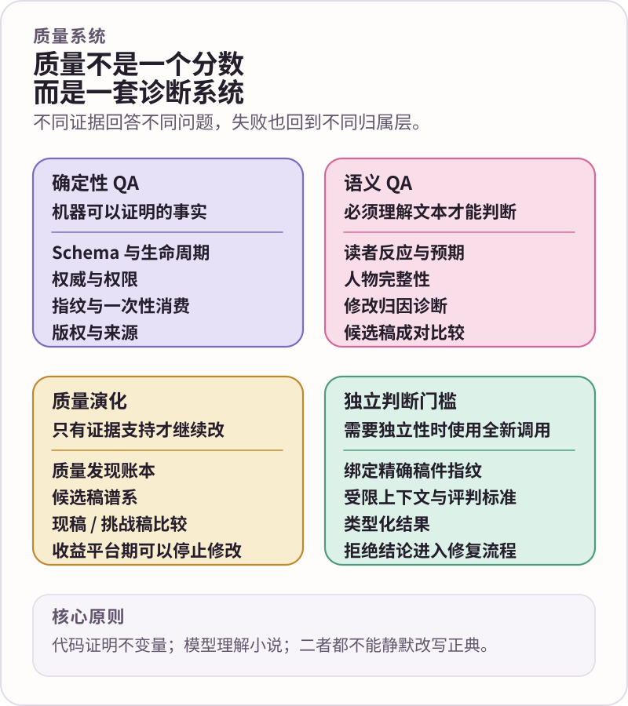

  
  
<strong>质量保障 · 能证明的交给代码，必须理解小说的交给有界模型契约</strong>

  
<kbd>确定性 QA</kbd>&nbsp;&nbsp;<kbd>语义契约</kbd>&nbsp;&nbsp;<kbd>质量发现</kbd>&nbsp;&nbsp;<kbd>候选演化</kbd>&nbsp;&nbsp;<kbd>发布门槛</kbd>

  
<a href="quality-assurance.en.md">English</a> · <a href="README.zh-CN.md">文档中心</a>

# 质量保障与 QA

NovelForge 没有一个万能“批评家 Agent”，也不把文学质量伪装成确定性总分。

它把五件事明确拆开：**代码究竟能证明什么、哪些问题必须让模型读懂文本、诊断如何形成可追踪 evidence、修复稿是否真的优于现稿，以及哪些门槛在发布前必须满足独立性要求。**

---

## 01 · 质量是一组不同的问题，不是一个总分

同一份候选稿完全可能在一个维度正确、在另一个维度严重失败。

因此 NovelForge 不让一个“综合评分”覆盖所有问题，而是分别问：

**结构与状态是否合法？** Schema、权威、权限、指纹、生命周期、引用、幂等性和事务前置条件属于确定性问题。

**正文实现是否健康？** Surface Fundamentals 负责识别反复出现的 realization 失败，但它不是文学审美总表。

**读者此刻真实体验如何？** Reader contracts 只使用读者可见信息，判断推进、困惑、回报、投入与继续阅读意愿。

**这个人物还是不是这个人物？** Character integrity 把场景行为与已有 typed character state 对照，而不是靠几个固定性格标签打分。

**修改问题真正属于哪一层？** Revision diagnosis 区分 story、plan、scene、character、reader pressure、surface、continuity、context / memory 与 research 等不同归属。

**修复稿真的变好了吗？** Candidate evolution 比较 incumbent 与 challenger，不假设“又改了一遍”就一定更好。

**长期承诺有没有被破坏？** Continuity 与 reader-expectation 机制检查事实、义务、setup / payoff 与长期关系证据。

任何一层的 PASS 都不能抵消另一层的 FAIL。

---

## 02 · 最重要的架构边界：语义理解与确定性约束分开

当前开发中的质量体系首先遵守整个 Framework 的 ownership 分工。

**由模型负责的语义智能**包括：读者反应、故事 / 人物解释、修改诊断、关系记忆协调、长程承诺审计，以及其他必须理解上下文才能作出的判断。

**由确定性运行时负责的部分**包括：权威、权限、内容指纹、持久化、路由、硬预算、阶段隔离、类型校验、一次性结果消费、版权 / 来源门槛、checkpoint 与事务。

确定性外壳可以验证一个语义结果是否类型正确、是否绑定当前稿件、是否允许消费；它不能偷偷发明一个“文学相关度”或“质量分”来代替模型阅读。

反过来，一个模型判断即使非常有说服力，也不会因此自动获得正典写入或 Framework 修改权威。

---

## 03 · 确定性 QA：只证明机器真正能证明的东西

只要某个不变量可以被精确表达，就优先让代码检查。

常见内容包括：

- Project manifest 与精确 Framework lock 是否兼容；
- Schema 与必填字段；
- 稳定 ID 是否唯一；
- `Plan / Review ≠ Accepted Canon` 之类的权威边界；
- artifact 与 semantic job 的内容指纹；
- result binding 与 consume-once；
- 权限与写入前置条件；
- session / run / checkpoint 生命周期；
- handoff lease 与 resume 安全；
- 依赖和引用完整性；
- 项目事实是否泄漏进通用 Framework；
- Corpus 权利与来源；
- blind eval queue 是否泄漏 hidden gold；
- Project / Framework bundle 是否可复现；
- settlement 的 compare-and-swap 与 postcondition。

这些检查适合普通 CI，因为它们结果可复现，也不需要模型调用。

它们故意**不声称**能证明“这一场有感情”“这个人物很可信”或者“这一章够好看”。

---

## 04 · Surface Fundamentals：正文实现的地板，不是文学神谕

Surface Fundamentals 保护文本 realization 层，专门处理反复出现的 AI 文本失败机制。

例如：无功能碎句、机械微动作、旁白强行 hype、流程播报、假意义感、POV / 声线泄漏、错误压缩 / 展开，以及其他已经明确建模的表层问题。

真正关键的是 repair ownership：

- 孤立表层缺陷 → 局部改写；
- 表层失败成簇 → 重做 scene realization / 整场景；
- 表层已经干净但场景仍然平 → 回 Reader Pressure + Scene Simulation。

这样才能避免一种典型退化：句子越来越顺，场景却依然没有因果、压力和生命力。

深入参考：[表层质量基础](../surface/FUNDAMENTALS.zh-CN.md)。

---

## 05 · Reader diagnostics 是证据，不会自动变成 independent gate

`quality` semantic pack 里包含 `reader.reaction` 与 `reader.compare`。

`reader.reaction` 模拟的是**冷启动阅读行为**：它只看到候选稿和真正对读者可见的上下文。大纲、未来计划、作者意图、隐藏 payoff、尚未揭示的 Canon、writer reasoning、上一位 reviewer 的 verdict，都不能拿来替文本“解释为什么其实很好”。

诊断结果可以记录：

- 读者是否愿意继续；
- 继续阅读欲望强弱；
- 哪里困惑、注意力掉落；
- 最喜欢 / 最卡顿的 beat；
- 情绪反应；
- 可能的 drop-off point；
- 形成这些反应的理由。

`reader.compare` 则比较两个候选稿，可以返回 `A`、`B` 或 `tie`。当顺序偏差值得检查时，可以交换 A/B 顺序再次判断。

这些 reader simulation 是**诊断证据**。它们本身并不声称自己天然满足 mandatory independent review。

深入参考：[读者吸引力](../surface/READER_ENGAGEMENT.zh-CN.md)。

---

## 06 · 人物完整性是一个独立的语义问题

`character.integrity` 负责判断重要人物在当前场景中是否仍然保持因果与心理一致性。

它可以检查：

- 当前行动是否和人物议程一致；
- 信念与知识边界；
- 声线；
- 关系位置；
- 空间位置与当前任务；
- 人物变化是否有足够过渡证据；
- 意外行为是否属于“可信的惊喜”，还是随机漂移。

审查时不能把 manager、旁白、读者或 research truth 的知识自动算到人物头上。

这样可以认真诊断 character drift，同时又不把 Character System 降级成一套确定性“性格规则”。

深入参考：[人物与关系系统](../core/CHARACTER_SYSTEM.zh-CN.md)。

---

## 07 · 先诊断，再决定怎么改

`revision.diagnose` 的存在，就是为了阻止“所有问题都再润色一遍”的循环。

模型只针对当前请求的质量维度进行诊断，并返回有证据支持的 findings 与 repair owner。真正开始下一轮 rewrite 之前，应先知道问题属于哪里。

可能的 owner 包括：

- story；
- plan；
- scene；
- character；
- reader pressure；
- surface；
- continuity；
- context / memory；
- research；
- runtime / human escalation。

`SAFE-BUT-FLAT` 明确不是 line-edit 问题；大量表层问题聚集在同一场景时，也可能应该重做整场 realization，而不是几十个局部 patch。

诊断结果仍然只是 evidence，不会自己修改 Canon。

---

## 08 · Findings 让质量证据可以跨会话追踪

一个质量问题不应该只存在于“上一轮聊天里好像说过”。

NovelForge 使用 typed findings，把诊断变成可以持久追踪的 evidence。按需要，一条 finding 应能说明：

- 到底哪里失败；
- 它描述的是哪个 candidate fingerprint；
- 证据在稿件或已建立状态的哪里；
- 属于哪个质量维度；
- repair owner 是谁；
- 当前仍然 open，还是已经被某个修复处理。

Finding 是证据记录，不是故事事实，因此也没有 Canon authority。

---

## 09 · Candidate Evolution：验证“有没有变好”，而不是假设“改了就会变好”

改写可以只是不同，并不一定更好。

`quality/quality_evolution.py` 因此只负责一个确定性 candidate-evolution ledger：记录候选稿指纹、父子关系、repair owner、精确 comparison job / result、当前 incumbent 与 plateau counter。

真正的比较判断仍然属于模型，通过 `creative-evolution` pack 的 `quality.compare` 完成；确定性 ledger 只负责记录和验证比较生命周期。

比较可以得出：

- challenger 更好；
- incumbent 仍然更好；
- 没有足够证据证明任一方明显更好 / tie。

如果连续修复没有产生真实增益，plateau stopping 可以结束这一轮演化，而不是为了“再试一次”无限重写。

深入指南：[质量演化](quality-evolution.zh-CN.md)。

---

## 10 · 长程 QA 保护的是承诺，不只是小设定

连续性远不只是“眼睛颜色有没有记错”。

`long-horizon` 契约包负责很多跨章节问题：

- `plan.reconcile` —— 因果自然演化后协调 active plan，但不反写 Accepted history；
- `relationship.memory_reconcile` —— 长期关系证据或派生记忆冲突时进行协调；
- `continuity.commitment_audit` —— 把候选稿与明确存在的叙事承诺、事实和义务对照。

`narrative-memory` pack 的 `reader.expectations` 还可以解释当前读者真正已经被文本建立了哪些期待，从而区分真实 setup / payoff obligation 与管理器私下的未来意图。

连续性问题可能属于 Story / Plan、Character、relationship state、Context / Memory 或 settlement，并不天然属于 prose revision。

---

## 11 · Semantic judgment 与 independent judgment 不是一回事

这是新版 QA 最需要说清楚的一条。

很多 semantic contract 都可以作为普通的 bounded model work 执行。它们仍然有明确输入、rubric、output contract 与 fingerprint，但**contract 本身并不因此宣称该调用具备独立性**。

只有当某个 workflow / rubric 明确要求 independence 时，才额外要求：

- 真正不同的 invocation / session；
- 有界 packet，而不是继承 manager 全部历史；
- 精确 candidate fingerprint binding；
- typed result；
- 看不到 hidden expected / gold；
- 稿件发生实质变化后，通常需要 fresh judgment。

Manager 可以 freeze、package、dispatch、validate、consume，但不能自己写完以后在同一 invocation 里换个“reviewer”标签满足门槛。

### 禁止 reviewer-shopping

transport failure 与 semantic rejection 是两个完全不同的状态。

基础设施失败可以切换到另一条同样 eligible 的执行路径；有效的 `semantic_reject` 是真实 evidence，必须回 repair layer。不断换 reviewer 直到出现 PASS，会直接破坏独立审查的意义。

深入参考：[语义执行器协议](../harness/semantic_workers/SEMANTIC_WORKER_PROTOCOL.zh-CN.md) 与 [语义执行运行时](../harness/semantic_workers/SEMANTIC_EXECUTION_RUNTIME.zh-CN.md)。

---

## 12 · Semantic fingerprint 与 run receipt 保护判断来源

每个 semantic job 都把具体 contract / kind、subject、受限输入、rubric 与 output contract 绑定成精确 fingerprint。worker session、transport attempt 等执行 lineage 与“这个语义问题本身是什么”分开记录。

因此：

- reviewer 不能实际审了另一份稿件却继续复用旧结果；
- 同一个 semantic job 因 transport failure 换执行路径，不会改变原问题；
- artifact、rubric 或 output contract 实质变化后会形成新 semantic fingerprint；
- validator 可以拒绝 stale 或错误绑定的结果。

provider-neutral semantic run receipt 负责留下受限执行 provenance，但 provider history 本身仍然不是故事权威。

---

## 13 · Blind eval 不让 reviewer 提前看到答案

Generic eval case 可以保存 expected outcome 用于最终评分，但这些字段不属于 reviewer context。

blind queue builder 会在 semantic dispatch 前移除 expected / gold / release-decision 等字段。负面 regression bad example 也不会在 Raw Draft 生成前进入 Writer context。

如果某个 semantic eval 当前没有 eligible judgment，状态保持 `PENDING_MODEL`；确定性 CI 不能为了绿灯伪造 PASS。

普通 CI 仍然可以完成：

- eval manifest 与 fixture 校验；
- deterministic release blocker；
- blind queue hygiene；
- schema 与 fingerprint；
- 明确版本化的 reviewed baseline；
- Project / Framework self-test 与可复现构建。

普通 CI 不会静默消耗付费或登录态模型额度。

实现参考：[NovelForge 评测](../evals/README.zh-CN.md)。

---

## 14 · 用户可见门槛按当前任务决定

并不是所有任务都需要把所有 semantic contract 跑一遍。

Manager 只加载当前任务、Project profile 与 rubric 真正需要的最小 contract set。

对于 `DRAFT` / `REVISE`，Raw Draft 永远只在内部。要把候选稿称为 review-ready，仍然必须解决当前适用的 Surface、Reader、Character / Story、continuity 与 independent gate。

真实的未完成状态包括：

`awaiting_user` · `awaiting_external` · `semantic_pending` · `failed_gate` · `settlement_incomplete`

NovelForge 宁可明确告诉用户“现在还没有通过”，也不制造假的 production-ready。

---

## 15 · 用户接受与 SETTLE 不是质量 verdict 的延伸

通过质量门槛不会自动改写 Canon。

用户先看到 review candidate，明确接受之后，才可能授权进入 `SETTLE`。Settlement 是另一套确定性 transaction：要求明确 acceptance evidence、精确 before→after writes、compare-and-swap precondition、checkpoint / write authorization、projection receipts 与 postcondition verification。

同样地，semantic reviewer 也不能“审核通过，于是自动写进正典”。

这四件事必须分开：

**质量证据 → 用户可见审阅 → 明确接受 → 授权结算。**

---

## 16 · 成本与限制 ⚠️

这套 QA 架构有真实成本：

- semantic diagnosis 会消耗模型或人工判断；
- independent gate 通常意味着额外 invocation，甚至另一条 provider / human 路径；
- 候选稿实质变化后，新 fingerprint 会让旧判断失效；
- candidate comparison 与 scene divergence 可能比简单 line edit 更耗 token；
- findings、receipts 与 checkpoints 增加工程流程；
- 执行契约即使非常精确，文学判断本身仍然带概率性。

只有当这些成本换来了更少的虚假自信、更低的连续性漂移、更少的“自己写自己审”，以及更清楚的 repair ownership 时，它们才值得存在。

---

## 17 · NovelForge 所谓“好的 QA”是什么

不是 reviewer 越多越好。

真正好的 QA 是：

- 代码只证明代码真正能证明的东西；
- 模型只拿到当前判断真正需要的最小契约与证据；
- Reader simulation 看不到创作者私有信息；
- Character judgment 尊重知识边界与人物议程；
- 先诊断，再 rewrite；
- repair 回到真正 owning mechanism；
- candidate evolution 允许 tie，也允许在 plateau 停止；
- 只有真正需要时才要求 independence；
- 每个结果都绑定它实际判断的 artifact；
- 任何质量结果都不能静默升级成 Canon authority。

  
   
  代码证明不变量；模型阅读小说；问题回到归属层；修改必须用证据证明。✦

## 修复中的目标保持

一次修复有两个彼此独立的语义问题：**目标缺陷是否改善**，以及**当前更高阶创作目标是否仍然成立**。Surface clean 不能替代 Story / Reader 质量。Material repair comparison 绑定 incumbent、challenger、repair target 与紧凑 `objective_envelope`；如果缺陷修掉了但 reader question、pressure、reward、人物/关系能量或 forward pull 等当前必保目标发生实质退化，记录为 `repair_induced_objective_regression`，保护 incumbent，并继续寻找新的 repair。系统不计算加权文学总分。
