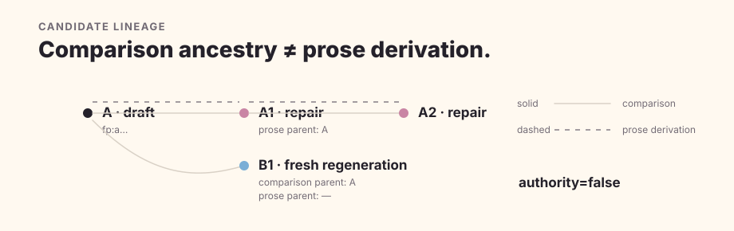

# Quality Evolution

Quillframe Quality Evolution is a durable comparison ledger for revision, not an automatic rewriting authority. It remembers which exact candidate is incumbent, which challenger was compared, what objective envelope governed the comparison, and whether further changes are still producing gain.

## Incumbent / challenger

A candidate enters with an exact content fingerprint. The challenger records a direct comparison parent. Registered `quality.compare` receives the incumbent, challenger, objective envelope, and bounded evidence; semantic judgment chooses challenger, incumbent, or tie. The deterministic layer verifies that the result is bound to the exact pair before consuming it once.

## Objective envelope

The objective envelope is selected from authorized Project/request evidence before repair. It protects the actual story/readership/character/pressure/reward goals from being optimized away by local polish. It cannot be reconstructed from rejected realization text.

## Candidate Lineage

Comparison ancestry and prose derivation are different relations. Repair normally uses the comparison parent as prose parent. Fresh regeneration has a comparison parent for evaluation but no prose parent, preserving the contamination boundary. User edit has explicit lineage rather than being treated as an untracked overwrite.

## Regression evidence

Repair-induced objective regression records collateral harm when the intended defect improves. Known-regression escape records where an already-known mechanism slipped past the stage expected to detect it. These are diagnostic provenance, not Canon and not autonomous repair authority.

## Stopping

A challenger selected by the registered semantic comparison becomes the new incumbent. An incumbent win or tie leaves the run active and records only the bound comparison evidence. No deterministic streak, score or counter stops revision; the model or author decides the next semantic action, and the runtime ends only through explicit completion.
