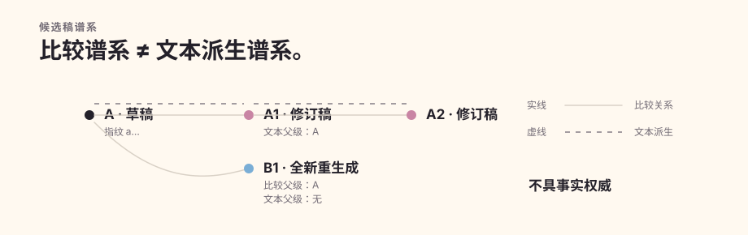

# 质量演进

Quillframe 的质量演进机制是一份用于修订的持久比较账本，不具备自动改写权。它记录精确的基准稿、挑战稿、比较时使用的目标约束集，以及继续修改是否还在产生真实收益。

## 基准稿与挑战稿

候选稿带着精确内容指纹进入比较；挑战稿会记录直接比较父级。已登记的 `quality.compare` 接收基准稿、挑战稿、目标约束集和受限证据，再由语义判断选择挑战稿、基准稿或平局。确定性层先验证结果是否绑定精确的比较双方，再执行一次性消费。

## 目标约束集

目标约束集会在修订前，从已经授权的项目证据或用户请求中选出，用来防止局部润色把真正的故事、读者、人物、压力和阶段回报目标优化掉。它不能从被拒绝的成稿文字重新推导。

## 候选稿谱系

比较谱系和文本派生是两种不同关系。修订稿通常把比较父级同时作为文本父级；全新重生成稿为了参与评估仍有比较父级，但文本父级必须为空，从而守住污染边界。用户编辑稿也显式记录谱系，而不是当成无法追踪的覆盖写入。

## 回退证据

修订引发的目标回退记录“目标缺陷改好但出现连带伤害”；已知规则漏检记录“已知问题没有在预期阶段被发现”。这些都属于诊断来源证据，不是正典，也不会授予系统自主修订权限。

## 停止条件

无收益比较会累积平台期状态；挑战稿胜出后成为新的基准稿。连续无收益可以终止修订，避免无限改写。停止规则属于执行策略，不会把未经评审的制品自动变成已接受稿。
