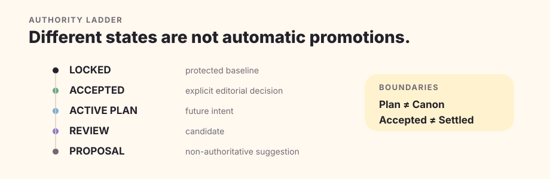

# Why Quillframe?

The filename of this page is a compatibility path from the former public brand. The current product name is **Quillframe**.

Quillframe exists because long-form fiction has two simultaneous needs that are easy to collapse into one another: creative interpretation must remain flexible, while authority and execution state must remain exact.

## The system boundary is the product

A useful fiction framework cannot make a deterministic script decide whether a relationship feels alive. It also cannot let a model decide that a plan has become Canon, that a stale review still applies, or that a failed write probably succeeded.

Quillframe therefore separates semantic ownership from deterministic ownership. Models or humans make judgments that require meaning. Code proves identities, permissions, fingerprints, lifecycle, provenance, transactions, and reproducibility.

## Long-form work needs authority, not just memory

A large memory window does not answer which facts are authoritative. Quillframe keeps Project truth, current state, plans, review candidates, derived memory, research, Corpus evidence, and runtime state in different authority classes. Sparse Context Manifests select only what the current task actually needs.

## Revision needs lineage, not rewrite churn

Revision can improve the local target while harming the chapter's real objective. Quillframe freezes an objective envelope, compares incumbent and challenger semantically, records repair-induced regression, and separates comparison ancestry from prose ancestry. A fresh regeneration can compete without inheriting rejected wording.

## Independence is a runtime property

A manager changing role labels inside the same invocation is not an independent reviewer. When independence is required, the artifact is frozen, fingerprinted, dispatched to a separate eligible invocation/session, validated against that exact fingerprint, and consumed once.

## Learning is automatic at intake, governed at promotion

Meaningful user feedback can enter a bounded learning intake from any primary task mode. Capture is automatic; promotion is not. `one_off`, `project`, `user_taste`, and `general_craft` remain separate scopes, and none receives durable write authority merely because a model inferred it.

## The tradeoff

Quillframe is intentionally heavier than a one-shot writing assistant. It is useful when a project lives long enough for continuity, state, revision provenance, recovery, independent review, and learning discipline to matter. For lightweight ideation or a single rewrite, a smaller tool may be better.

## Compatibility

The former public name remains embedded in technical identifiers such as `quillframe.toml`, `quillframe.lock.json`, schema names, workflow names, and repository paths. Those are compatibility surfaces, not current public branding, and this documentation migration intentionally preserves them.
