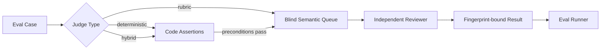

# Quillframe Evals

## Purpose

Quillframe separates **deterministic invariants** from **semantic quality judgment**.



The deterministic runner never pretends regex or heuristics are equivalent to literary judgment.

## Case types

- `regression`: protects against a known failure mechanism; release-blocking only when a valid deterministic/semantic baseline is available for that release path.
- `capability`: verifies the framework can recognize or produce a desired mechanism.
- `infrastructure`: validates schemas, authority boundaries, files, routing, and runtime contracts.

## Judge types

### `deterministic`
Code assertions only. Suitable for lifecycle, schema, file, authority, idempotency, and exact fixture properties.

### `rubric`
Requires a real independent semantic judgment. Missing judgment = `PENDING_MODEL`, never fabricated PASS.

### `hybrid`
Runs deterministic preconditions first, then semantic rubric.

## Blindness

Semantic case files may contain hidden `expected` values for eval scoring. `build_judge_queue.py` creates a separate **blind queue** that omits expected/gold/release labels before any reviewer sees the case.

Regression bad examples are evaluation fixtures. They do not enter first-pass Writer context.

## Normal CI

Normal CI:
- validates the eval manifest/cases;
- runs deterministic release blockers;
- builds blind semantic queues;
- validates that hidden expected labels are absent;
- may validate committed reviewed baselines when explicitly versioned.

A reviewed baseline is an **evidence index, not model output**. `validate_semantic_acceptance.py` rebuilds the current blind typed jobs and requires an exact case/fingerprint match against independently reviewed PASS provenance. Any rubric, fixture, or output-contract change that changes a fingerprint invalidates the old baseline and requires fresh independent review. The baseline never supplies judgments to `run_evals.py`.

Normal CI does **not** silently call paid/login-bound models.

## Semantic execution

A blind queue is converted to typed semantic jobs through the Harness semantic router, then dispatched through an eligible independent runtime. Results are fingerprint-bound and can be scored by `run_evals.py`.

Every live semantic run also emits `semantic-live-execution-identity.json` **before reviewer execution**. The content-addressed envelope binds the candidate commit and Framework version to the reviewer provider/model/config, blind queue and typed jobs, capability snapshot, semantic-harness source fingerprints, runner/Python environment, explicit resource-budget state, and GitHub run provenance. Unknown provider-managed revisions or unset budgets remain explicit unpinned/null facts rather than guessed metadata. Any bound field change changes `identity_fingerprint`.

This envelope is deterministic provenance, not semantic evidence by itself. Historical runs without it are not retroactively assigned identities, and its presence does not convert CI into a semantic quality claim.

## Paired AI-native ablations

Simplification decisions declared in `ai_native_ablation_manifest.json` use the registered independent `quality.ablation_compare` contract rather than manager-supplied semantic verdict fields. The reviewer receives only anonymous A/B condition results, exact input/result fingerprints, and neutral observation criteria. It does not receive `simpler_arm`, incumbent/challenger role names, removal intent, or hidden expected labels.

The evidence floor for simplifying one pair is **3 independent condition replicates × 2 swapped-order reviews per replicate = 6 pair reviews**. All three replicates must preserve the same blind queue, model/config, relevant harness, capability snapshot, and resource-budget conditions. The two reviews inside one replicate reuse the exact same arm outputs while swapping A/B order. Any material regression in the declared simpler arm vetoes simplification; conflicting directions or unclear regression evidence become `INCONCLUSIVE`; absent real independent model results remain `PENDING_MODEL`.

The deterministic evaluator validates registered-contract binding, candidate/queue/result/execution fingerprints, independent invocation lineage, exact 3:3 presentation counterbalance, and the predeclared decision protocol. It does not make literary judgments, and synthetic self-tests are never semantic evidence.

Live ablation execution is **manual-only**. Pull-request CI resolves to `deterministic_only` even if a repository provider credential exists. A human-authorized run must dispatch `quillframe-adaptive-production-semantic.yml` with `execution_mode=reader_contamination_3x2`. That mode executes exactly 3 two-arm condition batches plus 6 single pair-review jobs: a hard ceiling of **12 semantic calls** with no automatic retry beyond the ceiling. Each execution identity binds `max_semantic_calls=12`, the workflow timeout, and the named budget binding before the corresponding reviewer call. The resulting ablation decision is non-promotion evidence; it cannot turn the Framework feature gate into promotion PASS by itself.

## Commands

```bash
python evals/run_evals.py --release
python evals/build_judge_queue.py --output /tmp/semantic-queue.json
python evals/run_evals.py --judgments reviewed-results.json --json
python evals/validate_semantic_acceptance.py validate
python evals/evaluation_execution_identity.py self-test
python evals/evaluation_execution_identity.py validate semantic-live-execution-identity.json

python evals/evaluate_ai_native_ablation.py self-test
python evals/evaluate_ai_native_ablation.py prepare --output /tmp/ablation-observations.json
python evals/evaluate_ai_native_ablation.py review-job \
  --pair reader_contamination --replicate R1 --order INCUMBENT_FIRST \
  --incumbent-result /tmp/incumbent-result.json \
  --challenger-result /tmp/challenger-result.json \
  --output /tmp/ablation-review-job.json
python evals/evaluate_ai_native_ablation.py evaluate \
  --observations /tmp/ablation-observations.json \
  --output /tmp/ablation-evidence.json
```

## Quality domains

The initial v7 suite covers:
- Surface Fundamentals;
- Reader Engagement;
- Character/semantic ownership;
- Canon/Plan boundary;
- Corpus rights boundary;
- Project SDK/Framework hygiene;
- semantic runtime integrity.

The suite grows through user rejection evidence, corpus research, framework changes, and discovered capability gaps.
