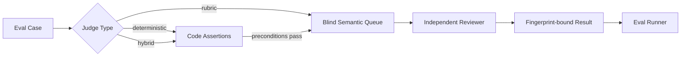

# NovelForge Evals

## Purpose

NovelForge separates **deterministic invariants** from **semantic quality judgment**.



The deterministic runner never pretends regex or heuristics are equivalent to literary judgment.

## Case types

- `regression`: protects against a known failure mechanism; release-blocking only when a valid deterministic/semantic baseline is available for that release path.
- `capability`: verifies the framework can recognize or produce a desired mechanism.
- `infrastructure`: validates schemas, authority boundaries, files, routing, and runtime contracts.

## Judge types

### `deterministic`
Code assertions only. Suitable for lifecycle, schema, file, authority, idempotency, and exact fixture properties.

### `rubric`
Requires a real independent semantic judgment. Missing judgment = `PENDING_MODEL`, never fabricated PASS.

### `hybrid`
Runs deterministic preconditions first, then semantic rubric.

## Blindness

Semantic case files may contain hidden `expected` values for eval scoring. `build_judge_queue.py` creates a separate **blind queue** that omits expected/gold/release labels before any reviewer sees the case.

Regression bad examples are evaluation fixtures. They do not enter first-pass Writer context.

## Normal CI

Normal CI:
- validates the eval manifest/cases;
- runs deterministic release blockers;
- builds blind semantic queues;
- validates that hidden expected labels are absent;
- may validate committed reviewed baselines when explicitly versioned.

A reviewed baseline is an **evidence index, not model output**. `validate_semantic_acceptance.py` rebuilds the current blind typed jobs and requires an exact case/fingerprint match against independently reviewed PASS provenance. Any rubric, fixture, or output-contract change that changes a fingerprint invalidates the old baseline and requires fresh independent review. The baseline never supplies judgments to `run_evals.py`.

Normal CI does **not** silently call paid/login-bound models.

## Semantic execution

A blind queue is converted to typed semantic jobs through the Harness semantic router, then dispatched through an eligible independent runtime. Results are fingerprint-bound and can be scored by `run_evals.py`.

## Commands

```bash
python evals/run_evals.py --release
python evals/build_judge_queue.py --output /tmp/semantic-queue.json
python evals/run_evals.py --judgments reviewed-results.json --json
python evals/validate_semantic_acceptance.py validate
```

## Quality domains

The initial v7 suite covers:
- Surface Fundamentals;
- Reader Engagement;
- Character/semantic ownership;
- Canon/Plan boundary;
- Corpus rights boundary;
- Project SDK/Framework hygiene;
- semantic runtime integrity.

The suite grows through user rejection evidence, corpus research, framework changes, and discovered capability gaps.
