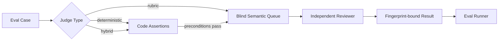

# NovelForge Evals · 评测系统

## 目的

NovelForge 严格区分 **deterministic invariant** 与 **semantic quality judgment**。



Deterministic runner 永远不能假装 regex/heuristic 等价于文学判断。

## Case Types

- `regression`：保护已知 failure mechanism；只有当前 release path 有真实 deterministic/semantic baseline 时才可作为 release blocker。
- `capability`：验证 Framework 能识别或实现目标 mechanism。
- `infrastructure`：验证 schema、authority、files、routing 与 runtime contract。

## Judge Types

### `deterministic`
只跑代码断言，适合 lifecycle、schema、file、authority、idempotency、exact fixture property。

### `rubric`
必须有真正 independent semantic judgment。缺失 judgment = `PENDING_MODEL`，绝不伪造 PASS。

### `hybrid`
先跑 deterministic precondition，再跑 semantic rubric。

## Blindness

Semantic case 文件可以保存 hidden `expected` 用于 eval scoring；`build_judge_queue.py` 会生成独立 **blind queue**，把 expected/gold/release label 全部剥掉后才交给 reviewer。

Regression bad example 是 eval fixture，不进入 first-pass Writer context。

## Normal CI

Normal CI：
- 验证 eval manifest/cases；
- 运行 deterministic release blockers；
- build blind semantic queue；
- 验证 hidden expected label 没有泄漏；
- 需要时可验证明确 versioned、人工/独立 reviewer 已审 baseline。

Normal CI **不会**静默调用付费或 login-bound model。

## Semantic Execution

Blind queue 先通过 Harness semantic router 变成 typed semantic jobs，再交给 eligible independent runtime。Result 做 fingerprint binding，最后由 `run_evals.py` 评分。

## Commands

```bash
python evals/run_evals.py --release
python evals/build_judge_queue.py --output /tmp/semantic-queue.json
python evals/run_evals.py --judgments reviewed-results.json --json
```

## Quality Domains

v7 初始 suite 覆盖：
- Surface Fundamentals；
- Reader Engagement；
- Character / semantic ownership；
- Canon / Plan boundary；
- Corpus rights boundary；
- Project SDK / Framework hygiene；
- Semantic runtime integrity。

Suite 会从用户拒绝证据、Corpus research、Framework changes 与新 capability gap 中持续增长。
