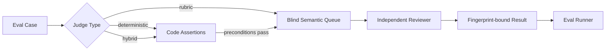

# Quillframe Evals · 评测系统

## 目的

Quillframe 严格区分 **deterministic invariant** 与 **semantic quality judgment**。



Deterministic runner 永远不能假装 regex/heuristic 等价于文学判断。

## Case Types

- `regression`：保护已知 failure mechanism；只有当前 release path 有真实 deterministic/semantic baseline 时才可作为 release blocker。
- `capability`：验证 Framework 能识别或实现目标 mechanism。
- `infrastructure`：验证 schema、authority、files、routing 与 runtime contract。

## Judge Types

### `deterministic`
只跑代码断言，适合 lifecycle、schema、file、authority、idempotency、exact fixture property。

### `rubric`
必须有真正 independent semantic judgment。缺失 judgment = `PENDING_MODEL`，绝不伪造 PASS。

### `hybrid`
先跑 deterministic precondition，再跑 semantic rubric。

## Blindness

Semantic case 文件可以保存 hidden `expected` 用于 eval scoring；`build_judge_queue.py` 会生成独立 **blind queue**，把 expected/gold/release label 全部剥掉后才交给 reviewer。

Regression bad example 是 eval fixture，不进入 first-pass Writer context。

## Normal CI

Normal CI：
- 验证 eval manifest/cases；
- 运行 deterministic release blockers；
- build blind semantic queue；
- 验证 hidden expected label 没有泄漏；
- 需要时可验证明确 versioned、人工/独立 reviewer 已审 baseline。

Reviewed baseline 是**证据索引，不是模型输出**。`validate_semantic_acceptance.py` 会重新生成当前 blind typed jobs，并要求每个 case 的 current fingerprint 与独立 reviewer 已审 PASS provenance 精确匹配。rubric、fixture 或 output contract 只要造成 fingerprint 变化，旧 baseline 就立即失效，必须重新进行独立评审。Baseline 永远不会给 `run_evals.py` 注入 judgment。

Normal CI **不会**静默调用付费或 login-bound model。

## Semantic Execution

Blind queue 先通过 Harness semantic router 变成 typed semantic jobs，再交给 eligible independent runtime。Result 做 fingerprint binding，最后由 `run_evals.py` 评分。

每次 live semantic run 还会在 reviewer 执行**之前**生成 `semantic-live-execution-identity.json`。这个 content-addressed envelope 会把 candidate commit / Framework version 与 reviewer provider、model/config、blind queue、typed jobs、capability snapshot、semantic harness source fingerprint、runner/Python environment、显式 resource-budget 状态和 GitHub run provenance 绑定起来。Provider-managed revision 或未配置 budget 如果无法精确确定，就保留为明确的 unpinned/null 事实，而不是猜测 metadata。任何已绑定字段变化都会改变 `identity_fingerprint`。

这个 envelope 是 deterministic provenance，本身不是 semantic evidence。历史 run 如果当时没有 execution identity，不会被追溯伪造；有 identity 也不会把 deterministic CI 自动变成 semantic quality claim。

## 作者单篇连续审阅

当目标是让作者直接判断一套创作指导写出来“像不像目标网文”，可以使用[单篇章节审阅协议](CRAFT_CHAPTER_REVIEW.zh-CN.md)。每轮只展示一篇通过完整生产发布边界的新章节；下一轮必须等待作者反馈，退回后还必须更换候选快照。该流程记录绝对读感，不强迫作者在两个失败版本里选相对优者，也不替代正式的跨作品 General Craft 推广证据。

## 原生章节评测运行器

`native_style_runner.py` 只编排 Core 已创建的原生 DRAFT/REVISE run，并且只能从 `production_runtime` 公共包导入受保护的 `ProductionRunExecutor`。它不得调用 provider、adapter、`AgentJob`、Codex 或 subprocess，也不接受现成正文。运行未通过完整生产图与独立 release boundary 时只返回无正文状态；完成后正文仍只能由 `CoreOperations.candidate_visible_get()` 读取。运行器没有接受、结算、发布或 Framework 提升权限。

## 语料行文文风消融

使用[三臂语料文风协议](STYLE_CORPUS_ABLATION.zh-CN.md)，在冻结的留出小说任务上比较无指导基线、当前技法 v4 与 **Craft V4 + 精确无来源 Corpus 候选**。Corpus 是注册 Craft 的 run-scoped 补充，不是替代品；V4 foundation 始终保留，Corpus 最多投射四条当前场景适用机制。每一对都会用密封处理标签、交换显示顺序重复评审；leave-one-work-out 和场景功能留出防止被评作品家族为自己的候选提供证据。盲读分维彼此独立，语义泄漏另设独立门槛。合成夹具只验证机械流程，绝不能冒充真实质量证据。

## Paired AI-native Ablations

`ai_native_ablation_manifest.json` 的 simplification 决策使用注册的独立 `quality.ablation_compare` contract，而不是 manager 自填 semantic verdict。Reviewer 只接收匿名 A/B condition result、exact input/result fingerprint 与 neutral observation criteria；看不到 `simpler_arm`、incumbent/challenger role、removal intent 或 hidden expected label。

每个 pair 的删除/简化 evidence floor 是 **3 个独立 condition replicates × 每个 replicate 2 次 swapped-order review = 6 次 pair review**。三个 replicate 必须绑定同一 blind queue / model-config / relevant harness / capability / resource-budget 条件；每个 replicate 的两次 review 必须共享同一组 arm outputs，并分别使用 A/B 两种顺序。任何 simpler-arm material regression 会 veto simplification；方向冲突或 regression 不明确则 `INCONCLUSIVE`；缺少真实独立 model result 一律保持 `PENDING_MODEL`。

Deterministic evaluator 只负责验证 registered contract、candidate/queue/result/execution fingerprint、独立 invocation lineage、3:3 presentation counterbalance 与预声明 decision protocol。它不做文学判断，也不会因为 synthetic self-test 通过就产生真实 simplification evidence。

Live ablation execution **只允许手动触发**。Pull-request CI 即使仓库已经配置 provider credential，也固定解析为 `deterministic_only`，不会自动花费模型调用。经过明确授权的实验必须手动 dispatch `quillframe-adaptive-production-semantic.yml`，并选择 `execution_mode=reader_contamination_3x2`。该模式只执行 3 个双-arm condition batch 加 6 个单独 pair-review job，总计 **12 次 semantic call 的硬上限**；超出上限直接拒绝，也不会为了补结果自动 retry。每次 reviewer execution 之前，其 execution identity 都会绑定 `max_semantic_calls=12`、workflow timeout 与命名 budget binding。得到的 ablation decision 只是 non-promotion evidence，本身不能把 Framework feature gate 自动提升成 promotion PASS。

## Commands

```bash
python evals/run_evals.py --release
python evals/build_judge_queue.py --output /tmp/semantic-queue.json
python evals/run_evals.py --judgments reviewed-results.json --json
python evals/validate_semantic_acceptance.py validate
python evals/evaluation_execution_identity.py self-test
python evals/evaluation_execution_identity.py validate semantic-live-execution-identity.json

python evals/evaluate_ai_native_ablation.py self-test
python evals/evaluate_ai_native_ablation.py prepare --output /tmp/ablation-observations.json
python evals/evaluate_ai_native_ablation.py review-job \
  --pair reader_contamination --replicate R1 --order INCUMBENT_FIRST \
  --incumbent-result /tmp/incumbent-result.json \
  --challenger-result /tmp/challenger-result.json \
  --output /tmp/ablation-review-job.json
python evals/evaluate_ai_native_ablation.py evaluate \
  --observations /tmp/ablation-observations.json \
  --output /tmp/ablation-evidence.json
```

## Quality Domains

v7 初始 suite 覆盖：
- Surface Fundamentals；
- Reader Engagement；
- Character / semantic ownership；
- Canon / Plan boundary；
- Corpus rights boundary；
- Native Project Contract / Framework hygiene；
- Semantic runtime integrity。

Suite 会从用户拒绝证据、Corpus research、Framework changes 与新 capability gap 中持续增长。
