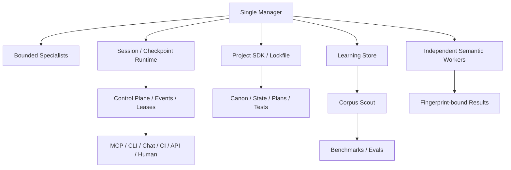

# Agent Framework Adoption Matrix

## Purpose

NovelForge is not a thin wrapper around a single agent SDK. It borrows stable mechanisms from mature agent/software frameworks, adapts them to long-form fiction, and rejects patterns that weaken authority, context isolation, or editorial control.

This document records **mechanisms**, not vendor loyalty.

## OpenAI Agents SDK

Reference areas: agents, orchestration, sessions, handoffs, guardrails, tracing, MCP.

### Adopt
- small set of runtime primitives rather than dozens of invented agent types;
- manager-controlled specialists / agents-as-tools for bounded subtasks;
- explicit handoff objects and structured outputs;
- guardrails around model/tool boundaries;
- persistent sessions as runtime memory;
- first-class tracing;
- MCP tool interoperability.

### Adapt
- OpenAI handoffs can forward conversation history; NovelForge defaults to **bounded context packets** for fiction specialists/reviewers rather than whole-history transfer;
- session memory is execution context only; Canon/project authority stays separate;
- independent semantic reviewers require separate invocation/session identity and fingerprint binding.

### Reject
- treating a provider conversation/session as project truth;
- assuming model/provider availability is required for every runtime path.

## LangGraph

Reference areas: checkpoints, threads, interrupts, stores, durable execution.

### Adopt
- durable checkpoint before human/external waits;
- explicit thread/session identity;
- interrupt/resume as a first-class state, not an error;
- **short-term execution state and long-term memory as separate stores**;
- recovery after process interruption.

### Adapt
- NovelForge separates three durable domains, not two:
  1. runtime/session state;
  2. user/craft learning state;
  3. project Canon/state.

### Reject
- storing entire story authority inside generic graph state;
- resuming without revalidating live project authority/fingerprints.

## Google ADK / agents-cli

Reference areas: session services, state/events, agent project scaffolding, skills, eval datasets, project manifests.

### Adopt
- standard project scaffold and manifest;
- tests/evals as normal parts of an agent project;
- shared coding-agent guidance files/skills;
- session event model;
- explicit project creation/upgrade workflow.

### Adapt
- NovelForge Project SDK scaffolds **fiction projects**, including Canon/state/plans/manuscripts/research/corpus/evals;
- framework upgrades are lockfile-bound dependency migrations.

### Reject
- tying the fiction project model to one cloud runtime or deployment target.

## Microsoft AutoGen

Reference areas: agent/team state, memory, teams, human-in-the-loop.

### Adopt
- explicit save/load state;
- memory as a protocol/retrieval boundary rather than implicit prompt stuffing;
- observable team/agent state;
- use teams only when the task truly needs collaboration or distinct capabilities.

### Adapt
- NovelForge default is **single manager + bounded specialists**;
- shared group-chat context is not the default for independent reviewers because it weakens blindness and context isolation.

### Reject
- round-robin multi-agent discussion as a default quality strategy;
- parallel stateful agents writing the same mutable Canon/state.

## Claude Code

Reference areas: project memory, scoped instruction files, hooks, session resume, CLI/MCP.

### Adopt
- repository-scoped agent instructions;
- nested/scoped instructions for subtrees;
- resumable local sessions;
- deterministic lifecycle hooks for operational telemetry/checkpoints;
- MCP integration.

### Adapt
- `CLAUDE.md` is project/runtime bootstrap, never Canon authority by itself;
- hooks may record/check operational state but do not substitute for independent semantic judgment.

### Reject
- prompt-based hooks secretly performing mandatory audit inside the same manager context;
- persisting accidental chat interpretations as project facts.

## Model Context Protocol (MCP)

Reference areas: lifecycle, capability negotiation, stdio, Streamable HTTP, tools/resources/prompts.

### Adopt
- standard JSON-RPC lifecycle;
- initialization/capability negotiation before operation;
- stdio for local agent runtimes;
- Streamable HTTP for future remote services;
- explicit tool schemas;
- strict stdout discipline for stdio;
- authentication/origin protections for remote transport.

### Adapt
- NovelForge exposes operational/project-safe tools and does not expose raw Canon-write authority by default;
- high-authority operations remain Harness/Settlement transactions.

### Reject
- inventing provider-specific connector protocols when MCP already fits;
- webhook arrival as implicit permission.

## Software-engineering project repositories

Reference pattern: feature specification → implementation plan → task graph → phase verification → build/test/release.

### Adopt
- feature specs for structural changes;
- exact target paths/objects;
- phase checkpoints;
- behavior/authority compatibility checks;
- build/test/verify as reproducible commands;
- dependency graph and migration planning.

### Adapt
- not every prose edit needs a feature spec;
- structural fiction changes, schema migrations, framework upgrades, and Canon migrations receive stronger engineering ceremony;
- chapter production uses plans/Scene Cards/evals rather than fake software tickets for every paragraph.

### Reject
- process for process's sake;
- treating artistic judgment as something deterministic unit tests can completely replace.

# NovelForge synthesis

## Governing heuristics

1. Start with one manager; add workers only for capability, isolation, independence, or real parallelism.
2. Separate execution memory, learning memory, and Canon state.
3. Pass bounded context, not whole histories, across specialist boundaries.
4. Make waits/resume durable and explicit.
5. Treat connectors/transports as capabilities, never authorities.
6. Treat projects as reproducible software artifacts with manifests, tests, builds, migrations, and lockfiles.
7. Use semantic workers for judgment, deterministic code for identity/state/invariants.
8. Learn from evidence and counterexamples, not from repeated self-assertion.

## Source maintenance

Framework research is evidence, not an automatic dependency update. When upstream frameworks change, NovelForge should record an adopt/adapt/reject candidate, run relevant capability/regression tests, and version any behavior change.
