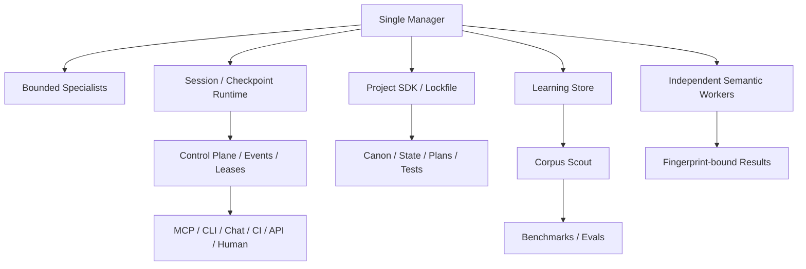

# Agent Framework Adoption Matrix · Agent 框架机制采用矩阵

## 目的

NovelForge 不是某一个 Agent SDK 的薄封装。它会从成熟 Agent / 软件工程框架中提取稳定 mechanism，再按长篇小说生产需求做 adapt；任何会削弱 authority、context isolation、editorial control 的机制都应被拒绝。

这里记录的是**机制选择**，不是厂商忠诚度。

## OpenAI Agents SDK

参考范围：agents、orchestration、sessions、handoffs、guardrails、tracing、MCP。

### Adopt
- 少量清晰 runtime primitives，而不是人为发明几十种 agent；
- manager-controlled specialists / agents-as-tools 做 bounded subtask；
- 显式 handoff 与 structured output；
- model/tool 边界 guardrails；
- persistent session 作为 runtime memory；
- first-class tracing；
- MCP interoperability。

### Adapt
- 普通 handoff 可能继承大量 conversation history；NovelForge 默认给 fiction specialist / reviewer **bounded context packet**，不复制整段历史；
- session memory 只是 execution context，Canon/project authority 独立存在；
- independent semantic reviewer 必须有独立 invocation/session identity 与 fingerprint binding。

### Reject
- 把 provider conversation/session 当成 project truth；
- 假设每种 runtime 都必须依赖同一个模型/API。

## LangGraph

参考范围：checkpoint、thread、interrupt、store、durable execution。

### Adopt
- human/external wait 前 durable checkpoint；
- 显式 thread/session identity；
- interrupt/resume 是一等状态，不是异常；
- **短期 execution state 与长期 memory 分离**；
- process interruption 后可恢复。

### Adapt
NovelForge 不只分两类，而是三个 durable domain：
1. runtime/session state；
2. user/craft learning state；
3. project Canon/state。

### Reject
- 把全部 Story authority 塞进 generic graph state；
- resume 时不重新验证 live project authority / fingerprint。

## Google ADK / agents-cli

参考范围：session service、state/event、agent project scaffold、skills、eval datasets、project manifest。

### Adopt
- 标准 project scaffold + manifest；
- tests/evals 是 agent project 正常组成部分；
- coding-agent guidance / skills；
- session event model；
- 显式 create/upgrade workflow。

### Adapt
- NovelForge Project SDK scaffold 的是**小说软件工程**：Canon/state/plans/manuscripts/research/corpus/evals 都是标准目录；
- framework upgrade 通过 lockfile dependency migration 处理。

### Reject
- 把小说项目结构绑定到某一家云 runtime/deployment target。

## Microsoft AutoGen

参考范围：agent/team state、memory、teams、human-in-the-loop。

### Adopt
- explicit save/load state；
- memory 作为 retrieval/protocol boundary，而不是默认把所有历史塞进 prompt；
- agent/team state 可观测；
- 只有复杂任务真正需要协作/不同能力时才使用 team。

### Adapt
- NovelForge 默认 **single manager + bounded specialists**；
- independent reviewer 默认不共享 group-chat 全上下文，避免 blindness/context isolation 被破坏。

### Reject
- round-robin agent 讨论作为默认“提高质量”方案；
- 多个 stateful agent 并发写同一 mutable Canon/state。

## Claude Code

参考范围：project memory、scoped instruction、hooks、session resume、CLI/MCP。

### Adopt
- repository-scoped agent instructions；
- 子目录可有 scoped instructions；
- resumable local session；
- deterministic lifecycle hooks 记录 operational telemetry/checkpoint；
- MCP integration。

### Adapt
- `CLAUDE.md` 是 project/runtime bootstrap，不是 Canon authority；
- hooks 可以记录/检查 operational state，但不能冒充 independent semantic judgment。

### Reject
- 用 prompt hook 在同一 manager context 里偷偷完成 mandatory independent audit；
- 把偶然 chat interpretation 永久写成项目事实。

## Model Context Protocol (MCP)

参考范围：lifecycle、capability negotiation、stdio、Streamable HTTP、tools/resources/prompts。

### Adopt
- 标准 JSON-RPC lifecycle；
- operation 前 initialization/capability negotiation；
- 本地 runtime 用 stdio；
- 未来 remote service 用 Streamable HTTP；
- explicit tool schemas；
- stdio stdout 只输出 protocol message；
- remote transport 需要 auth / Origin 等安全边界。

### Adapt
- NovelForge 默认只暴露 operational/project-safe tools；不直接暴露无条件 Canon-write tool；
- 高 authority 操作仍走 Harness/Settlement transaction。

### Reject
- MCP 已能解决时继续发明 provider-specific connector protocol；
- webhook 到达就等于获得权限。

## Software-engineering Project Repository

参考 mechanism：feature specification → implementation plan → task graph → phase verification → build/test/release。

### Adopt
- structural change 使用 feature spec；
- exact target paths/objects；
- phase checkpoint；
- behavior/authority compatibility check；
- reproducible build/test/verify；
- dependency graph + migration plan。

### Adapt
- 不是每一次正文小改都建 feature spec；
- 结构变化、schema migration、framework upgrade、Canon migration 使用更强工程流程；
- chapter production 使用 plans/Scene Cards/evals，不把每段文字伪装成软件 ticket。

### Reject
- 为流程而流程；
- 以为 deterministic unit test 可以替代全部艺术判断。

# NovelForge 综合架构

## Governing Heuristics

1. 默认一个 manager；只有 capability、isolation、independence 或真实 parallelism 需要时才增加 worker。
2. execution memory、learning memory、Canon state 三者分离。
3. specialist boundary 传 bounded context，不传整段历史。
4. wait/resume 持久化、显式化。
5. connector/transport 只是 capability，不是 authority。
6. 小说项目是可重建的软件 artifact：manifest、tests、build、migration、lockfile 都应存在。
7. deterministic code 管 identity/state/invariant；semantic worker 管需要判断的部分。
8. 学习依赖 evidence + counterexample，而不是模型重复自我确认。

## Source Maintenance

Framework research 只是 evidence，不会因为上游版本更新就自动改变 NovelForge。上游出现新机制时，先形成 adopt/adapt/reject candidate，再跑 capability/regression，行为变化必须 versioned + rollbackable。
