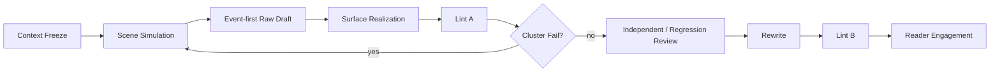

# Surface Fundamentals · Framework Quality Contract

## Purpose

This is NovelForge's default prose-realization safety layer. It exists because language models exhibit recurring cross-project failure mechanisms that should not be rediscovered in every novel.

These rules are **framework fundamentals**, not one project's house style.

```text
Framework Surface Fundamentals
        ↓
Genre / Platform Profile
        ↓
Project Profile
        ↓
User Taste Profile
        ↓
Current Request
```

Lower layers may tune thresholds and opt into deliberate exceptions. They may not silently turn known model failure mechanisms back into defaults.

> Clean prose is a floor, not a finished chapter.

## Production principle

**Backstage design language must become lived prose.**

Internal concepts such as state transition, permission, pressure, relationship change, foreshadowing, payoff, information advantage, resource constraint, and character arc should normally appear in fiction as people, objects, money, time, tasks, mistakes, choices, refusals, misunderstandings, physical consequences, and social consequences.

If the narrator is merely translating the scene card into abstract prose, realization has failed.

## Mandatory realization loop



Raw Draft is internal. If a failure cluster comes from one mechanism, regenerate the scene rather than patching isolated sentences.

# HF Family · Default Hard Fail Mechanisms

The canonical IDs are stable mechanism labels. Implementations may add diagnostics, but should not redefine the mechanism casually.

## HF-01 · NON-FUNCTIONAL FRAGMENTATION

Fail when sentence/paragraph fragmentation is used to simulate speed, seriousness, or cinematic cutting without a real state change.

High-risk pattern:

```text
micro-action.
line break.
reaction.
line break.
ordinary fact.
line break.
```

Fast pacing should primarily come from faster information arrival, narrowing choices, immediate opposition, deadlines, consequences, and state change—not typography.

Deliberate fragment-heavy projects may opt in through a profile, but fragments still require narrative function.

## HF-02 · MICRO-SHOT STORYBOARDING

Fail when prose decomposes a continuous action into a sequence of camera-like microshots that do not independently matter.

Repair by restoring the natural narrative unit, not merely joining sentences mechanically.

## HF-03 · NARRATOR THESIS / AUTHOR SUMMARY

Fail when the narrator explains the meaning that the scene already established.

High-risk forms:
- “The real point was…”
- “This meant…”
- “Only then did he understand…”
- “From that moment on…”
- abstract conclusion after a concrete scene.

If deleting the summary preserves the reader's understanding, delete it. If meaning is genuinely missing, add event/choice/evidence before adding explanation.

## HF-04 · DESIGN-LANGUAGE LEAK

Fail when planning/database terminology leaks into prose without belonging to character language.

Examples: relationship upgrade, pressure node, permission change, information advantage, payoff, arc progression used as narrator explanation.

Translate design into observable consequences.

## HF-05 · DOSSIER INTRODUCTION

Fail when a character's first appearance reads like a profile card: age, clothing, job, history, personality, reputation, and current attitude delivered together without scene need.

Reveal only the identity information the current action actually uses.

## HF-06 · ORNAMENTAL METAPHOR

Fail when comparison/personification exists primarily to manufacture literary texture, especially generic body/time/memory/city/fate metaphors.

This is profile-sensitive: literary profiles may permit higher rhetoric. The fundamental rule is that the figure must improve perception, voice, or meaning—not merely decorate an ordinary fact.

## HF-07 · ABSTRACT EMOTION LABEL

Fail when “complex,” “indescribable,” “strange,” “confused,” “moved,” or equivalent vague interiority substitutes for a concrete judgment object.

Useful interiority names what is being tested, chosen, feared, rejected, remembered, calculated, or socially managed.

## HF-08 · EMPTY MICRO-ACTION

Fail when nodding, looking, setting down a cup, rubbing fingers, silence, or similar micro-actions are inserted only to make dialogue “visual.”

Keep an action when it changes timing, ownership, information, relationship, task progression, spatial constraint, or emotional interpretation.

## HF-09 · RANDOM EMBODIMENT PATCH

Fail when a previously disembodied scene is “fixed” by sprinkling unrelated gestures rather than restoring task, agenda, object, and space.

Embodiment must be causal, not decorative blocking.

## HF-10 · MECHANICAL DIALOGUE TAGGING

Fail when speaker ambiguity is solved by attaching `X said` to nearly every turn while voice, agenda, task, and spatial ownership remain absent.

Tags are tools; ownership is the goal.

## HF-11 · SPEAKER DRIFT / DISEMBODIED DIALOGUE

In multi-character scenes, fail when ownership depends primarily on ABAB alternation or turn counting.

Reliable ownership may come from:
- explicit address/name;
- distinctive agenda or voice;
- role-specific task/object;
- unique knowledge;
- spatial position;
- causal action;
- another character's response target.

After a third speaker enters, reset alternation assumptions.

## HF-12 · DIALOGUE WORLD ERASURE

Fail when extended dialogue makes current work, objects, space, time pressure, and participant agendas disappear.

Conversation happens **inside** a continuing world and task.

## HF-13 · INTERVIEW / TRANSCRIPT DIALOGUE

Fail when dialogue becomes pure information exchange with characters waiting for their assigned lines.

Participants should pursue objectives, withhold, misunderstand, interrupt, bargain, test, evade, or act while speaking when appropriate.

## HF-14 · CONSTRAINT LEAK / RULE DEFENSE

Fail when backend rules appear in prose as negative proof that the author obeyed them.

Example mechanism: narrator explicitly says nobody suspected a forbidden trope because the project rules prohibit that trope.

Would the sentence exist if the backend prohibition had never been written? If not, remove or realize the scene naturally.

## HF-15 · SIGNIFICANCE INFLATION

Fail when an ordinary object/action receives isolated emphasis, contrast words, reaction pauses, or polished follow-up solely to appear meaningful.

Keep emphasis when the beat changes action, inference, risk, relationship, identity, location, resource, or another concrete state.

## HF-16 · STAGED ROUTINE REVEAL

Fail when routine identity/context information is arranged as synthetic movie revelation:

```text
inventory
→ narrow focus
→ isolated name/date/object
→ decorative detail
→ reaction pause
```

Major irreversible information may deserve emphasis. Routine facts should normally be discovered through purposeful action/search.

## HF-17 · PROP CATALOGUE

Fail when concrete detail is produced by inventory rather than character purpose.

A prop earns space when someone uses, needs, loses, moves, pays for, inspects, misreads, transfers, withholds, or makes a decision because of it.

## HF-18 · ABSTRACT AGENT

Default fail when abstractions such as memory, time, history, fate, city, silence, darkness, or destiny are personified without a strong voice/perception reason.

Profile-sensitive exception is allowed, but generic model decoration is not.

## HF-19 · MANNERISM CONNECTOR

Words equivalent to “unexpectedly / instead / just then / as if / apparently / it turned out” are not banned. Fail when they repeatedly manufacture significance, fake contrast, or smooth missing causality.

Delete the polished connector/follow-up: if nothing meaningful changes, rewrite or merge.

## HF-20 · SUBJECT / SENTENCE TEMPLATE REPETITION

Fail when many consecutive sentences restart with the same character name/pronoun + small action, or repeat a fixed short-short-long rhythm regardless of content.

Sentence rhythm should emerge from information and action structure.

## HF-21 · PROCESS BROADCAST

Fail when prose narrates routine operations at equal weight merely because the outline contains them.

Compress routine procedure. Expand friction, error, disagreement, choice, risk transfer, cost, relationship movement, surprise, and consequence.

## HF-22 · CHECKLIST CAUSALITY

Fail when a scene advances as a list of correct steps rather than consequences that create the next action.

Bad:

```text
open → inspect → correct → check → send
```

Better mechanism:

```text
problem → partial solution reveals cost → choice → reaction → changed options → consequence
```

## HF-23 · FAKE CLIFFHANGER / NARRATOR ADVERTISEMENT

Fail when chapter-end propulsion is supplied by abstract authorial advertising rather than changed story state.

Examples:
- “The real crisis had only begun.”
- “He did not yet know everything would change.”

Concrete incoming information, consequence, choice, voice, object, reversal, or next-state intrusion is allowed.

## HF-24 · FORCED MYSTERY

Fail when ordinary information is withheld or phrased vaguely solely to create cheap suspense.

Mystery must arise from real information boundaries, uncertainty, deception, missing evidence, or character limitation.

## HF-25 · EXPLANATION AFTER EVIDENCE

Fail when concrete action/dialogue demonstrates a point and the narrator immediately restates the same point abstractly.

Trust the strongest layer. Do not duplicate meaning.

## HF-26 · FUNCTIONAL-CHARACTER COLLAPSE

Fail when a supporting character exists only to deliver information, praise the protagonist, obstruct on schedule, or trigger a planned beat.

Important characters retain their own agenda, information limits, work, emotional residue, relationships, and plausible initiative.

## HF-27 · SEMANTIC ROLE MISATTRIBUTION

Fail when interiority, comparison, summary, or evaluative language belongs to the narrator/model rather than the character or focal perspective that could actually own it.

For each psychological or interpretive statement ask: **whose mind/voice could truthfully generate this wording now?**

## HF-28 · CONTEXT DEFENSE PROSE

Fail when the text visibly protects itself from imagined criticism by explaining why a character did not ask, did not suspect, did not notice, or did not behave according to a trope—unless that absence is itself causally relevant.

## HF-29 · AI POLISH WITHOUT STORY FUNCTION

Catch-all cluster fail for sentences whose primary purpose is to sound polished, cinematic, profound, or “writerly” while adding no useful perception, voice, causality, tension, relationship, information, or rhythm.

This label should not be used lazily; identify the more specific HF mechanism whenever possible.

# Paragraph and sentence fundamentals

## Paragraphs are narrative units

A paragraph may combine action, observation, dialogue, response, local judgment, spatial/object change, and immediate consequence. It does not need all of them. It does need a coherent narrative reason for its boundary.

Standalone short paragraphs are strongest when they carry real interruption, irreversible action, key information, high-pressure pause, or directional dialogue.

## Complete syntax by default

Commercial/readable prose normally prefers clear complete sentences. Fragments are allowed when they carry genuine semantic impact, not because the model is imitating “pace.”

## Detail follows POV task

Concrete detail should be selected by what the focal character is doing, needing, fearing, comparing, searching, misunderstanding, or deciding—not by an invisible camera inventory.

## Narrator distance

The narrator should not behave like an editor standing outside the scene labeling what everyone feels or explaining how important each beat is. Use behavior, dialogue, choice, object interaction, and decision-specific interiority first.

# Failure repair routing

```text
isolated lexical/sentence hit → local rewrite
repeated same-mechanism hits → paragraph/block rewrite
multi-mechanism scene cluster → return to Scene Simulation
procedure/checklist flatness → return to causal scene design
character-function collapse → Character Simulation
semantic-role drift → POV/Character ownership repair
```

Do not fix Surface Safety by deleting all energy, emphasis, humor, mystery, or forward pull. Reader Engagement is a separate positive gate.
