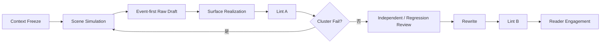

# Surface Fundamentals · 框架级正文质量契约

## 目的

这是 NovelForge 默认的正文实现安全层。它存在的原因不是某一本书“口味特殊”，而是语言模型在不同项目里会重复出现一批高度稳定的失效机制；这些机制不应该每写一本小说就重新踩一遍。

因此这些规则属于 **Framework Fundamentals**，不是 Project House Style。

```text
Framework Surface Fundamentals
        ↓
Genre / Platform Profile
        ↓
Project Profile
        ↓
User Taste Profile
        ↓
Current Request
```

下层可以调阈值，也可以对明确的艺术性例外 opt-in；但不能偷偷把已经确认的 AI failure mechanism 恢复成默认写法。

> 正文没有硬伤，只是地板，不是成品。

## Production Principle

**后台设计语言必须转译成生活中的正文。**

内部可以讨论状态变化、权限、压力、关系变化、伏笔、兑现、信息差、资源约束、人物弧；正文通常应该把它们变成人、物件、钱、时间、任务、失误、选择、拒绝、误解、身体后果和社会后果。

如果旁白只是把 Scene Card 换成抽象中文重新说一遍，Surface Realization 就失败了。

## Mandatory Realization Loop



Raw Draft 只在内部存在。同一 failure mechanism 在一场里成簇出现时，回 Scene Simulation 整场重做，不逐句贴补。

# HF Family · 默认 Hard Fail Mechanisms

HF ID 是稳定的 mechanism label。实现可以增加诊断，但不能轻易改掉 mechanism 本身。

## HF-01 · NON-FUNCTIONAL FRAGMENTATION / 无功能碎片化

当句子或段落被人为切碎，只是为了模拟速度、严肃感或镜头剪辑，而没有真实状态变化时，Fail。

高风险结构：

```text
一个微动作。
换行。
一个反应。
换行。
一个普通事实。
换行。
```

真正的快节奏主要来自更快的信息到达、更窄的选择窗口、即时阻力、deadline、后果和连续状态改变，而不是排版。

明确采用 fragment-heavy 的实验性 Profile 可以 opt-in，但碎句仍必须承担叙事功能。

## HF-02 · MICRO-SHOT STORYBOARDING / 微动作分镜

当一个完整动作链被拆成大量“镜头式”微动作，而每个微动作本身都不改变任何东西时，Fail。

修复目标是恢复自然叙事单位，不是机械把句号换成逗号。

## HF-03 · NARRATOR THESIS / AUTHOR SUMMARY / 作者总结

当旁白解释场景已经通过行为证明的意义时，Fail。

高风险结构：
- “真正重要的是……”
- “这意味着……”
- “直到这时他才明白……”
- “从这一刻起……”
- 一个具体场景结束后再补一段抽象结论。

删掉总结后读者仍能理解，就删。如果意义真的没有建立，优先补事件、选择和证据，而不是补解释。

## HF-04 · DESIGN-LANGUAGE LEAK / 后台设计词泄漏

Scene/Database 中的关系升级、压力节点、权限变化、信息差、兑现、角色弧等内部术语，除非角色在当前职业/语境里真的会这样说，否则不应直接进入正文。

要把设计语言转成可观察后果。

## HF-05 · DOSSIER INTRODUCTION / 档案式人物介绍

人物第一次出现时，如果一次性交代年龄、衣服、职位、历史、性格、名声、当前态度，像在读人物卡，Fail。

首次出场只给当前动作真正需要的身份信息。

## HF-06 · ORNAMENTAL METAPHOR / 装饰性比喻

比喻、拟人只是为了制造“文学质感”，尤其是通用的身体、时间、记忆、城市、命运类修辞时，Fail。

这条允许 Profile-sensitive exception：文学型项目可以提高修辞容忍度。但基础规则不变——修辞必须改善感知、声线或意义，不能只是给普通事实抛光。

## HF-07 · ABSTRACT EMOTION LABEL / 空泛情绪标签

“复杂”“说不清”“奇怪”“恍惚”“不知道该说什么”之类模糊心理，如果替代了具体 judgment object，Fail。

有效 interiority 应该说明：角色此刻在测试、选择、害怕、拒绝、回忆、计算、猜测或处理什么社会问题。

## HF-08 · EMPTY MICRO-ACTION / 空微动作

点头、看一眼、放杯子、摩挲手指、沉默等动作，如果唯一用途是给对白“加画面”，Fail。

动作只有在改变 timing、ownership、information、relationship、task progression、space 或 emotional interpretation 时才值得保留。

## HF-09 · RANDOM EMBODIMENT PATCH / 随机动作补画面

已经失去身体/任务感的对白，不能靠随手撒一些无关动作修复。真正的修复是把 task、agenda、object、space 恢复回来。

Embodiment 必须有因果，而不是舞台走位装饰。

## HF-10 · MECHANICAL DIALOGUE TAGGING / 机械对白标签

如果 speaker ambiguity 通过给几乎每一句都补“某某说”解决，而角色声线、agenda、任务、空间归属仍然消失，Fail。

标签是工具，ownership 才是目标。

## HF-11 · SPEAKER DRIFT / DISEMBODIED DIALOGUE / 说话人漂移

多人场景里，如果读者主要靠 ABAB 轮换或数行数判断谁在说话，Fail。

可靠 ownership 可以来自：
- 名字/称呼；
- 独特 agenda 或声线；
- 角色专属 task/object；
- 只有该角色掌握的信息；
- 空间位置；
- 直接触发台词的动作；
- 另一个角色明确回应其对象。

第三个人插话后，必须重置原有轮换假设。

## HF-12 · DIALOGUE WORLD ERASURE / 对白抹掉世界

长对白导致正在做的工作、物件、空间、时间压力和参与者 agenda 全部消失时，Fail。

人是在一个持续运转的世界和任务里说话，不是在对白黑箱里轮流报句子。

## HF-13 · INTERVIEW / TRANSCRIPT DIALOGUE / 采访稿对白

如果对白只是纯信息交换，每个人等着轮到自己送台词，Fail。

人物应该根据场景需要争取、隐瞒、误解、插话、试探、讨价还价、回避、行动。

## HF-14 · CONSTRAINT LEAK / RULE DEFENSE / 后台规则自证

后台 prohibition 不得在正文里变成“证明自己遵守规则”的否定句。

例如：因为项目禁止某种 trope，旁白特意解释“没有人怀疑某某”。

测试：如果后台从没写这条禁止规则，这句话还会自然出现吗？不会，就删掉或重新实现。

## HF-15 · SIGNIFICANCE INFLATION / 普通事实意义膨胀

普通物件/动作被单独拎出来，加反差词、停顿、漂亮 follow-up，只为了显得“有意义”，Fail。

只有它改变下一步行动、推断、风险、关系、身份、地点、资源或其他具体状态时，才值得强调。

## HF-16 · STAGED ROUTINE REVEAL / 普通信息电影式揭晓

Routine identity/context 被排成：

```text
盘点
→ 镜头缩窄
→ 单独名字/日期/物件
→ 装饰细节
→ 停顿反应
```

通常 Fail。

真正重大、不可逆的信息可以获得强调；普通事实应在角色主动搜索/行动中自然出现。

## HF-17 · PROP CATALOGUE / 道具清单化

具体细节来自“摄像机盘点”而不是人物目的时，Fail。

一个物件值得出现，是因为有人用它、需要它、丢了它、移动它、付钱买它、检查它、误读它、转交它、扣住它，或者因为它改变决定。

## HF-18 · ABSTRACT AGENT / 抽象物拟人

记忆、时间、历史、命运、城市、沉默、黑暗等抽象物，如果没有强烈 POV/voice 理由却像角色一样行动，默认 Fail。

Profile 可以明确提高容忍度，但 Generic Model Decoration 不行。

## HF-19 · MANNERISM CONNECTOR / 连接词制造意义

“居然 / 反而 / 偏偏 / 仿佛 / 似乎 / 原来”等词本身不禁用。重复用它们制造普通事实的“意义”、伪反差或填补因果缺口时，Fail。

把连接词或 polished follow-up 删除，如果没有任何信息损失，说明原句需要重写或合并。

## HF-20 · SUBJECT / SENTENCE TEMPLATE REPETITION / 句式模板重复

连续大量“人物名/他/她 + 微动作”重新起句，或无论内容都套固定的短—短—长节奏，Fail。

句子节奏应该由信息与动作结构自然产生。

## HF-21 · PROCESS BROADCAST / 流程播报

Outline 有几个操作步骤，不代表正文要等权逐个播报。

Routine procedure 应压缩；争执、失误、选择、风险转移、代价、关系变化、惊讶和后果应展开。

## HF-22 · CHECKLIST CAUSALITY / 清单式因果

场景如果只是正确步骤列表，而不是“上一步造成下一步”，Fail。

差：

```text
打开 → 检查 → 修改 → 再检查 → 发送
```

更强的 mechanism：

```text
问题 → 部分解决暴露代价 → 选择 → 反应 → 选项改变 → 后果
```

## HF-23 · FAKE CLIFFHANGER / NARRATOR ADVERTISEMENT / 假悬念广告

章尾靠抽象旁白广告制造 forward pull，Fail。

例如：
- “真正的危机才刚刚开始。”
- “他还不知道一切都会改变。”

真实存在的消息、声音、后果、选择、物件、反转或下一状态侵入都可以成为合法 forward pull。

## HF-24 · FORCED MYSTERY / 强行神秘化

普通信息只是为了廉价悬念被故意含糊、延迟或遮住时，Fail。

真正的 mystery 应来自角色知识边界、不确定性、欺骗、缺失证据或认知限制。

## HF-25 · EXPLANATION AFTER EVIDENCE / 证据后重复解释

动作/对白已经证明一件事，旁白马上再抽象解释同一件事，Fail。

保留最强的一层，不重复意思。

## HF-26 · FUNCTIONAL-CHARACTER COLLAPSE / 功能 NPC 化

配角只负责送信息、夸主角、按计划挡路或触发剧情节点，Fail。

重要角色必须保留自己的 agenda、knowledge limit、工作、情绪余波、关系和可信主动性。

## HF-27 · SEMANTIC ROLE MISATTRIBUTION / 语义角色归属错误

心理、比较、总结、评价性语言，如果真正属于 narrator/model，而不是当前 POV/character 能拥有的语气与认知，Fail。

每一句 interpretive statement 都问：**此刻到底是谁的脑子/声线能真实生成这句话？**

## HF-28 · CONTEXT DEFENSE PROSE / 防御性正文

文本为了预先堵住读者质疑，反复解释“为什么某人没问、没怀疑、没发现、没按 trope 行动”，而这些 absence 本身并无因果价值时，Fail。

## HF-29 · AI POLISH WITHOUT STORY FUNCTION / 无叙事功能的 AI 抛光

兜底 cluster fail：一句话的主要功能只是显得精致、电影感、深刻、像“会写”，却没有增加 perception、voice、causality、tension、relationship、information 或 rhythm。

不要滥用这条；能归到更具体 HF 时，应使用具体 mechanism。

# 段落与句子基础规则

## 段落是叙事单位，不是镜头切片

一个段落可以混合动作、观察、对白、回应、局部判断、空间/物件变化和立即后果。它不必全有，但换段必须有叙事理由。

独立短段在真正的打断、不可逆动作、关键信息、高压停顿或改变场景方向的台词上最有效。

## 默认完整语法

商业/可读型正文默认使用自然、清楚的完整句。残句可以存在，但必须真的承载语义冲击，而不是模型模仿“节奏感”。

## Detail 跟随 POV task

细节应该由 focal character 当前在做什么、需要什么、怕什么、比较什么、寻找什么、误解什么、决定什么来筛选，而不是由无形摄像机盘点。

## Narrator Distance

旁白不能像站在场外的编辑，替所有人物贴情绪标签、解释每个节点有多重要。优先使用行为、对白、选择、物件互动和 decision-specific interiority。

# Failure Repair Routing

```text
孤立词句命中 → local rewrite
同 mechanism 重复 → paragraph/block rewrite
多 mechanism scene cluster → 回 Scene Simulation
procedure/checklist flatness → 回 causal scene design
character-function collapse → Character Simulation
semantic-role drift → POV / Character ownership repair
```

不能为了 Surface Safety 把所有能量、强调、幽默、神秘感和 forward pull 一起删掉。Reader Engagement 是独立的正向质量门。
